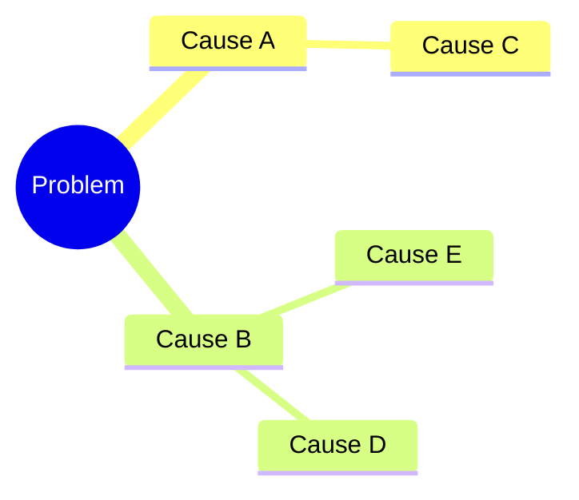
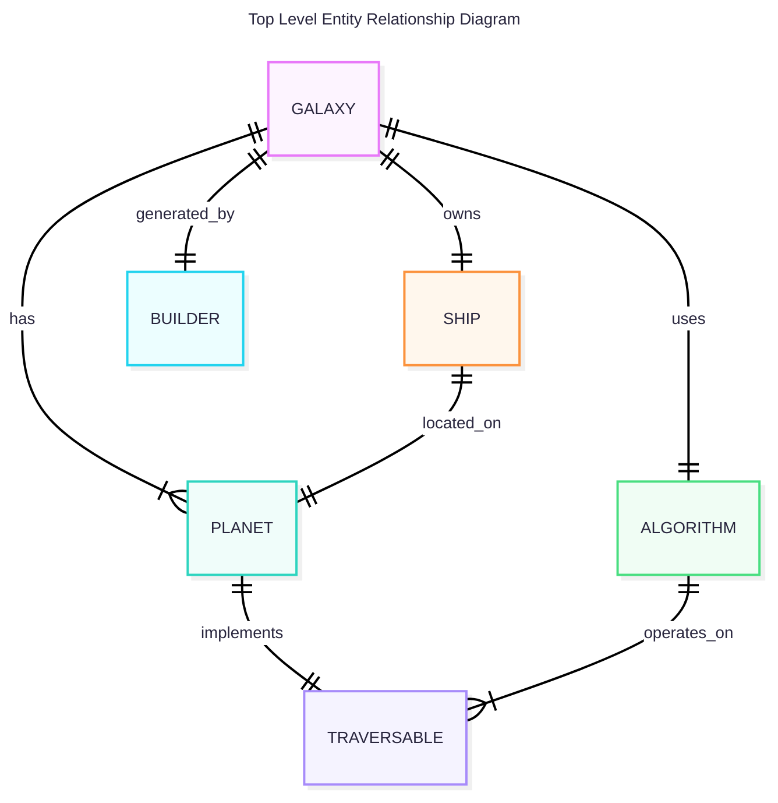
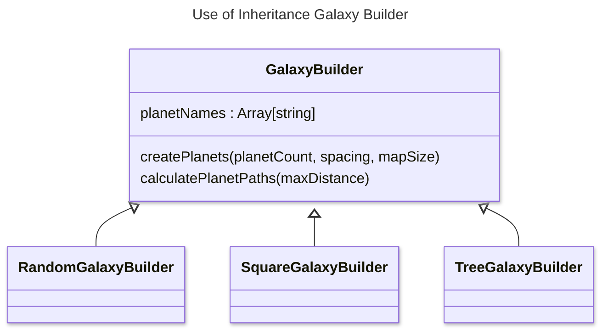
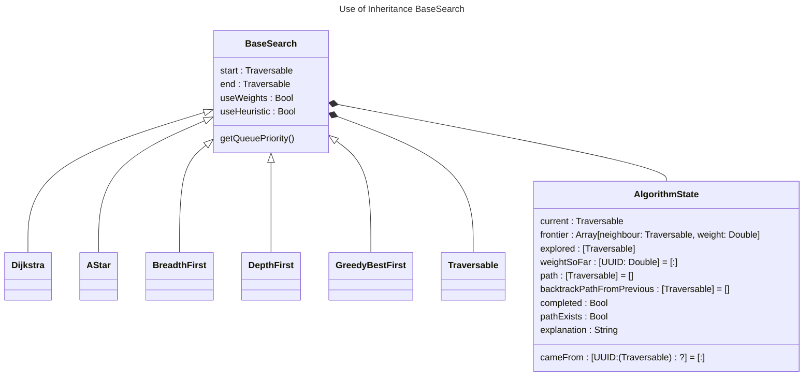

# OCR A-Level Computer Science NEA Write-Up (H446)

*(Total: 75 marks — ~3000–6000 words, ~25–40 pages)*

---

## Table of Contents

- [1. Title Page and Contents](#1-title-page-and-contents)
- [2. Analysis (12 marks)](#2-analysis-12-marks)
  - [2.1 Problem Definition](#21-problem-definition)
  - [2.2 Stakeholders and User Needs](#22-stakeholders-and-user-needs)
  - [2.3 Existing Solutions and Research](#23-existing-solutions-and-research)
  - [2.4 Requirements Specification](#24-requirements-specification)
  - [2.5 Success Criteria](#25-success-criteria)
- [3. Design (12 marks)](#3-design-12-marks)
  - [3.1 System Overview / Architecture](#31-system-overview--architecture)
  - [3.2 Data Design](#32-data-design)
  - [3.3 Algorithm Design](#33-algorithm-design)
  - [3.4 UI / User Interaction Design](#34-ui--user-interaction-design)
  - [3.5 Test Plan (Pre-Development)](#35-test-plan-pre-development)
- [4. Development (25 marks)](#4-development-25-marks)
  - [4.1 Implementation Overview](#41-implementation-overview)
  - [4.2 Key Algorithms and Techniques](#42-key-algorithms-and-techniques)
  - [4.3 Integration and Refinement](#43-integration-and-refinement)
  - [4.4 Testing During Development](#44-testing-during-development)
  - [4.5 Meeting Success Criteria](#45-meeting-success-criteria)
- [5. Testing (15 marks)](#5-testing-15-marks)
  - [5.1 Final System Testing](#51-final-system-testing)
  - [5.2 Evidence of Testing](#52-evidence-of-testing)
  - [5.3 Test Evaluation](#53-test-evaluation)
- [6. Evaluation (11 marks)](#6-evaluation-11-marks)
  - [6.1 Success Criteria Evaluation](#61-success-criteria-evaluation)
  - [6.2 Strengths and Weaknesses](#62-strengths-and-weaknesses)
  - [6.3 Future Improvements](#63-future-improvements)
  - [6.4 Personal Reflection](#64-personal-reflection)
- [7. Appendices](#7-appendices)
- [8. Summary Table](#8-summary-table)

---

## 1. Title Page and Contents

**Marks:** 0  
**Suggested length:** ~100–150 words

- Project title, your name, centre number, candidate number  
- Table of contents  
- Optional short abstract (problem + solution summary)

---

## 2. Analysis (10 marks)

**Suggested length:** ~700–1000 words

### 2.1 Problem Definition 
Describe the real-world problem or scenario and why it is suitable for a computational solution.

Explain how graph algorithms is a classic computer science problem
Interactive tools are suited for a computer program
Learning tools are more accessible for computers
Can remember state and go forward and backwards on the algorithm
algorithm to generate graphs

I am making an educational tool that aims to create a fun way for anyone to learn about graphing algorithms through space.
I will do this in the form of an app using Swift and SwiftUI using the Model View Controller Design Pattern.

The problem I am solving is the lack of fun ways to learn about certain Computer Science (CS) concepts, more specifically graphing algorithms.
From experience I have noticed that when looking for resources online to help learn a new concept there are a separation between the engaging resources which are often videos using creative analogies and the interactive tools used to model them which are often boring and difficult to use and stuck in the browser. This could be due to the relative difficulty to make a program compared to a video.

I want to bridge that gap by creating a graphing algorithm simulator that uses a fun analogy of Space to keep the user engaged. From my research you will later see I beleve that space is an engaging subject for many people interested in computer science and even if they are not it is still a fun tool that they do not have to use

### 2.2 Stakeholders and User Needs
Identify users/stakeholders, their goals, constraints, and environment.

My audience is anyone who is interested in learning about CS. This could be anyone from the age of 8 to 80 who is interested. This may seem like quite a broad audience due to the wide age range I can slightly narrow it down to those who are more STEM focused.

Specifically I am targeting a younger audience as they are the future generation, and I want to create interest among the younger generation as they are still deciding what they are going to do with their lives. It is also true that this age group spends lots of time on mobile applications and playing video games so this may appeal more to them.

Therefore I feel like an app is the most accessible form to this audience

My stakeholders are mostly Students studying graphing algorithms for the first time in A-Level CS aswell as some GCSE students and some adults, as my goal is to make this tool accessible to people not activelly studying computer science.

I have interviewed these stakeholders and I aim to use this data to tailor the experience to be more engaging across my audience. I am going to refer back to these users as I develop the app.

#### Questionnaire for target market

| **Which of the following subjects do you find most engaging. (Space, )** |     |
| --- |     | --- |
| Stakeholder 1: |     |
| Stakeholder 2: Noah | Space |
| Stakeholder 3 |     |

| **When using a tool to learn a new subject would you rather have more freedom or a more guided path** |     |
| --- |     | --- |
| Stakeholder 1: |     |
| Stakeholder 2: Noah | I would like both, maybe you could start with a more guided approach and then once you are more familliar you could be given more control |
| Stakeholder 3 |     |

#### Client Questionnaire takeaways

Space

Control

### 2.3 Existing Solutions and Research

Summarise current solutions (manual or digital) and their limitations.

I have selected a few educational tools that aimed to create an interactive way to learn something. I tried out these tools and noted down the parts that I liked and disliked about them.

#### Solution 1: Graph Online

This is a graphing simulator I found online. It lets you create a graph manually

I thought it was frustrating making a graph manually and thought it would be especially not useful if this was your first time encountering a graph you may not know what graph to make.
I found the options overwhelming and did not focus on anything specific. I thought It was more suitable for people more experienced with the basics. I want my project to be accessable to people who do not know what a graph is.

#### Solution 2: 


#### Solution 3: PhET Simulations

This is not a graphing simulator but it is an educational tool making learning interesting.
There are lots of different high quality simulations on this platform. 
PhET Is a non profit organisation founded by Carl Weiman. They have made their own framework for making simulations

I loved using this and found it very useful but one thing I would have liked is if it added a creative twist to it to keep the user engaged. As this is a large platform with lots of pI may want to use an anlaogy of some sort to make the program more relatable to use.


#### Research Takeaways

The main things I took away is that I wanted to make the program approachable and relatable to the user, intuitive to use and not rely on any knowledge fromthe user, this would make it accessible to my whole audience which is anyone seeking to learn about graphing algorihms


### 2.4 Requirements Specification

List:
- Functional requirements  
- Non-functional requirements (usability, performance, reliability, etc.)

### 2.5 Success Criteria

Numbered, testable criteria (SC1, SC2, …) that you will revisit in Testing and Evaluation.

---

## 3. Design (15 marks)

**Suggested length:** ~800–1200 words

### 3.1 System Overview / Architecture

High-level description of system structure and modules.

### 3.2 Data Design

Data structures, database schema, file formats, key variables, data dictionary/ERD if needed.

### 3.3 Algorithm Design

Pseudocode/flowcharts for key algorithms, with justification of choices.

### 3.4 UI / User Interaction Design

Wireframes / layout and explanation of navigation and usability decisions.

### 3.5 Test Plan (Pre-Development)

Planned tests (normal, boundary, invalid) mapped to requirements/success criteria.

---

## 4. Development (25 marks)

**Suggested length:** ~1200–1800 words

### 4.1 Implementation Overview

Languages, tools, libraries, and main modules.

### 4.2 Key Algorithms and Techniques

Annotated snippets for complex/interesting parts; explain how they work and why you used them.

### 4.3 Integration and Refinement

How modules were combined; key bugs, problems, and solutions.

### 4.4 Testing During Development

Iterative/unit testing done while coding; evidence and fixes.

### 4.5 Meeting Success Criteria

For each SC, show where in the system it is implemented and evidenced.

---

## 5. Testing (15 marks)

**Suggested length:** ~600–900 words

### 5.1 Final System Testing

Comprehensive table of test cases (ID, Input, Expected, Actual, Pass/Fail).

### 5.2 Evidence of Testing

Screenshots/logs for key tests; include normal, boundary, invalid data.

### 5.3 Test Evaluation

Discuss what the results show about correctness, robustness, and reliability.

---

## 6. Evaluation (20 marks)

**Suggested length:** ~500–800 words

### 6.1 Success Criteria Evaluation

Go through SC1…SCn: fully/partially/not met, with evidence.

### 6.2 Strengths and Weaknesses

Technical and usability evaluation; what worked well, what didn’t.

### 6.3 Future Improvements

Specific, realistic enhancements (new features, better algorithms, refactoring).

### 6.4 Personal Reflection

What you learned: programming, algorithms, planning, problem-solving.

---

## 7. Appendices

**Marks:** 0 (supporting evidence)

Include where appropriate:
- Full code listing or repository link  
- Full test data / logs  
- User guide / installation guide  
- Extra diagrams, glossary, bibliography  

---

## 8. Summary Table

| Section            | Marks | Suggested Words | Notes                          |
|--------------------|:-----:|----------------:|--------------------------------|
| Title + Contents   | 0     | ~150            | Professional presentation      |
| Analysis           | 12    | 700–1000        | Problem + requirements         |
| Design             | 12    | 800–1200        | Algorithms + data + UI + tests |
| Development        | 25    | 1200–1800       | Core technical detail          |
| Testing            | 15    | 600–900         | Strong evidence + coverage     |
| Evaluation         | 11    | 500–800         | Critical, criteria-based       |
| Appendices         | 0     | —               | Supporting material            |


```swift
protocol Traversable: Identifiable {
    // This property requirement comes from Identifiable.
    var id: UUID { get }
    func getNeighbours()->[(neighbour : any Traversable, weight : Double)]
    func isEqual(to other: any Traversable) -> Bool
    func heuristic(to end: any Traversable) -> Double
    
}
```

 ### Mindmap



| **Name :**<br><br>Noah Marks | **Candidate Number : 1146** |
| --- | --- |
| **Agenda :**<br><br>Engaging Graphing Simulator | **Centre Number :*10132* |


<!-- TODO: Mention Computer Science (CS) abbreviation -->

# A level Comp-Sci Writeup 

## Analysis

### Problem Recognition

The problem I am solving is the lack of fun ways to learn about certain Computer Science (CS) concepts, more specifically graphing algorithms.
Interactive simualtion's are usefull tools for learning as they can walk you through new concepts especially for STEM and Computer Science. Good learning also comes from relatable analogies and creative teaching methods. The flexibility of Coding allows you to express this creativity through a program. Therefore a computer simulation a suitible method to teach a topic like graphing algorithms 

From experience I have noticed that when looking for resources online to help learn a new concept there are a separation between the engaging resources which are often videos using creative analogies and the interactive tools used to model them which are often boring and difficult to use and stuck in the browser. This could be due to the relative difficulty to make a program compared to a video
I want to bridge that gap by creating a graphing algorithm simulator that uses a fun analogy of Space to keep the user engaged. From my research you will later see I beleve that space is an engaging subject for many people interested in computer science and even if they are not it is still a fun different way to 

Graphing algorithms are often found to be a difficult topic for Computer Science Students as they have not been exposed to these concepts before.
I will make a educational tool that aims to create a fun way for anyone to learn about graphing algorithms through space.
I will do this in the form of an app using Swift and SwiftUI.

### Analysing Other Solutions

**I have selected a few educational tools that aimed to create an interactive way to learn something. I tried out these tools and noted down the parts that I liked and disliked about them.**

#### Solution 1: Graph Online

This is a graphing simulator I found online. It lets you create a graph manually

I thought it was frustrating making a graph manually and thought it would be especially not useful if this was your first time encountering a graph you may not know what graph to make.
I found the options overwhelming and did not focus on anything specific. I thought It was more suitable for people more experienced with the basics. I want my project to be accessable to people who do not even know what a graph is.

#### Solution 2: 

#### Solution 3: PhET Simulations

This is not a graphing simulator but it is an educational tool making learning interesting.
There are lots of different high quality simulations on this platform. 
PhET Is a non profit organisation founded by Carl Weiman. They have made their own framework for making simulations

I loved using this and found it very useful but one thing I would have liked is if it added a creative twist to it to keep the user engaged. As this is a large platform with lots of pI may want to use an anlaogy of some sort to make the program more relatable to use.

#### Research Takeaways

The main things I took away is that I wanted to make the program approachable and relatable to the user, intuitive to use and not rely on any knowledge fromthe user, this would make it accessible to my whole audience which is anyone seeking to learn about graphing algorihms. It 

### Stakeholders and Audience

My audience is anyone who is interested in learning about CS. This could be anyone from the age of 8 to 80 who is interested. This may seem like quite a broad audience due to the wide age range but I can slightly narrow it down to those who are more STEM focused.
Specifically I am targeting a younger audience as they are the future generation, and I want to create interest among the younger generation as they are still deciding what they are going to do with their lives. It is also true that this age group spends lots of time on mobile applications, playing video games or using computers so this may appeal more to them.

Therefore I feel like an app is the most accessible form to this audience

My stakeholders are mostly Students studying graphing algorithms for the first time in A-Level CS aswell as some GCSE students and some adults, as my goal is to make this tool accessible to people not activelly studying computer science.

I have interviewed these stakeholders and I aim to use this data to tailor the experience to be more engaging across my audience. I am going to refer back to these users as I develop the program.

### Questionnaire for target market

| **Which of the following subjects would you find most engaging for a learning tool.** |Space, Geographical or City|
| --- | --- |
| Stakeholder 1: Rambo| City |
| Stakeholder 2: Noah | Space |
| Stakeholder 3 : Rocco |Geographical Landscape|

| **When using a tool to learn a new subject would you rather have more freedom or a more guided path** |     |
| --- || --- |
| Stakeholder 1: Rambo | More control would be nice but it should be easy/intuitive to use |
| Stakeholder 2: Noah | I would like both, maybe you could start with a more guided approach and then once you are more familliar you could be given more control |
| Stakeholder 3 : Rocco | I would rather be guided at the start as I can find the options overwhelming    |

| **Which of the following analogies do you find most relatable and interisting : Space, CityMap, RuralMap** |     |
| --- || --- |
| Stakeholder 1: Rambo | I would love a space analogy |
| Stakeholder 2: Noah | The ruralMap would be cool but also the Space |
| Stakeholder 3 : Rocco | The Industrial Map would be cool but also the Space |


#### Client Questionnaire takeaways

I beleve a Space analogy will be the most suitable for the audience. This makes sense as my stakeholders are mostly into STEM so were already facinated by space.

I think it is importaint to have at least a slow introduction into the algorithms. From research of other games I found the solutions that had an easy onboarding to be more useful. My stakeholders backed this up.


### Features of Proposed solution

#### Usability

**Menu with Navigation across screens**
My app should allow the user to navigate between different screens. This should be intuitive and the user should not get lost.

**Clean Design**
I will make the apearance of the app minimal with clear controls.

Creation of graph

#### Performance
The simulation should be able to run on lower end older hardware. This will make it more accesable to more people.
The program should not abruptly crass

#### Bugs/Exploits
There should not be any Major bugs or exploits in the program.
As this would confuse/mislead the user.

#### Information/Teaching

As this is an educational tool everything needs to be factually correct.
After and during development.

I will also make small quality of life improvements that make explanations more true to what is actually happening

** Move into design   show tree of navigation **
These screens should include:
* Menu (for selection)
* How to use (explains how to use the program)
* About Graphs (Teaches the user about graphs using a text page (not the simulation)
* Graph/Galaxy Builder (Allows the user to create/select/generate graph)
* Simulation (Performs the Graph Traversal Algorithms on the generated graph

### Limitations of Solution

It may not be a very accurate simulation of the universe as there are many factors that are likely not included. Humans have not even explored another planet, so we do not know what it takes to explore a universe.

It may be hard to show how the algorithms involved work so the game can only educate the user on if they exist.

I may not have the capacity to add lots of levels so it may be limited to a tutorial and a main level.

### Using Computational Methods in the solution

#### Thinking Abstractly

I am going to use AI generated 2D sprites as this will not be time consuming and will be easy to implement while also providing an appealing aesthetic.

As My graphing simulator is set in space, I need to consider which features to keep to make the simulation at least somewhat accurate. This is a graphing simulator not an ultra-realistic space simulation so I am able to remove things without making the program useless to the user.
I will abstract lots of details of space and simplify it to just a graph with a few aesthetic objects in the backround for visual appeal.

I have looked at many aspects of space and noticed that there are many extra ideas that seem unnecessary and will overcomplicate the program. For example, adding planet Orbits would mean the nodes on the graph would have to move around. This not only complicates the development of the game but also adds extra complexities the user has to manage which would be frustrating, for example orbits would mean that the shortest path would be constantly changing. This would confuse the user which is a problem for an introduction to the subject.

I am going to remove aspects that do not add much value to the experience.

#### Thinking Ahead

#### Thinking Procedurally

I am going to break the game down into sub-systems to make it easier to write.
I will use a top down design when designing the archtecture


#### Thinking Logically

#### Thinking Concurrently

Lots of parts of my program will hapen at the same time. The ship will need to move, the galaxy will need to be generated, the paths will need to be found

### Choosing a Framework

| **Platform** | **Description** | **Pros** | **Cons** |
| --- | --- | --- | --- |
| Unity/Unreal | Game engines will provide me with<br><br>Some examples of game engines I could use are Godot, Unity and Unreal Engine. | I could make the game 3D however my game<br><br>Lots of lower-level UI interactions, e.g. panning, can be managed by the engine.<br><br>Lots of functionality is pre-baked into the engine meaning I will not have to code these elements. However this will mean that I have less control over the game which is a negative. | A game engine can be overly complex for my simple game, they are best for games involving more complex graphics |
| Godot | Godot is a lightweight Game engine used for both 2D and 3D games | Very lightweight and simple to use.<br><br>I can write in GDScript which is a simple language based of python but can still be statically typed for efficiency.<br><br>I can easily export to many different platforms |     |
| Swift / SpriteKit | Swift is Apples programming language and SpriteKitis a simple graphics API I could use with it to make my game. SpriteKit is still feature ritch and powerful with their Node System and SKActions. | I could make my game work on all apple devices such as tablets and phones which is a more convenient way.<br><br>It will be more efficient as swift is statically typed meaning it will be more optimised by the compiler | The game will not be playable on other platforms like android or windows as will be exclusively iOS. |
| Pygame | Pygame is a simple 2D graphics library that uses python. | I can write the game in python which has easy syntax and is quite lightweight. | It is very basic so I will have to program algorithms like shortest path from scratch |
| Defold | Defold is a simple Game Engine that uses Lua |     |     |

#### Choice

The main three contenders are Swift / SpriteKit, Pygame and Godot.

After considering the benefits and drawbacks of each framework I have swift for my project. I will specifically be using SpriteKit for the game's graphics and SwiftUI for the controls and User Interface. I like the simplicity of this as it means I have more control over my game. Another main factor in my decision means I can program it in swift which is a strongly typed language meaning great efficiency compared to something like using python with pygame which was a close second choice. I prefer this over a game engine which would require me to code in C# or C++ which are more complex.

However this will mean that the app can only be played on apple devices, this could be a good start as they are popular with my audience. I found it is also quite difficult to have an android version aswell as I would need to rewrite it due to the specific frameworks I have selected. It may have been more accessible if I made a webapp

### System Requirements
#### Hardware

My game will be played on either a computer, tablet or a mobile device.
As I am using SwiftUI it will have to be an apple device such as an iPad, Mac or iPhone

| **Requirement** | **Reason** |
| --- | --- |
| Computer Mouse or touchscreen | Used for selecting objects and playing the game |

#### Software

| **Requirement** | **Reason** |
| --- | --- |
| Runs macOS, iOS, iPadOS | Swift, SwiftUI and SpriteKit only works on these operating systems |

### Success Criteria

| **Criteria** | **Reason** |
| Teach what a graphing algorithm is | The  |
| Show the uses of graphing algorithms | The user should know what graph graphs and graph traversal algorithms are used for (e.g maps)|
| Simulate a variety of graphing algorithms on a variety of graphs | I need to show that there is a range of graphing algorithms that are used and their benifits and drawbacks. A variety of graphs will be better as different algorithms work better for different graphs |


## Design

### System Overview / Architecture

| **Object** | **Overview** | **Update Logic** | **Render** |
| --- | --- | --- | --- |
|     |     |     |     |

**Explain diagram and high level of components, Model veiw controller**








## Developing A coded Solution

## Evaluation

## Sources


https://www.ocr.org.uk/Images/324587-project-setting-guidance.pdf
https://www.ocr.org.uk/images/170844-specification-accredited-a-level-gce-computer-science-h446.pdf
