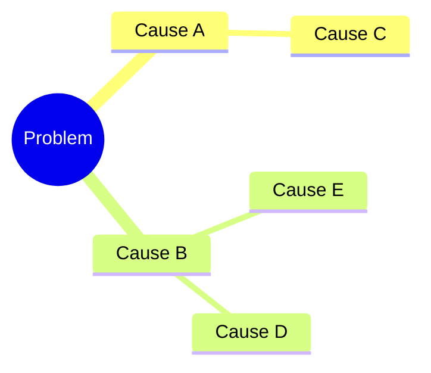

# A level Comp-Sci Writeup 

```swift
protocol Traversable: Identifiable {
    // This property requirement comes from Identifiable.
    var id: UUID { get }
    func getNeighbours()->[(neighbour : any Traversable, weight : Double)]
    func isEqual(to other: any Traversable) -> Bool
    func heuristic(to end: any Traversable) -> Double
    
}
```


## Analysis

 ### Mindmap



| **Name :**<br><br>Noah Marks | **Candidate Number :** |
| --- | --- |
| **Agenda :**<br><br>Engaging Graphing Simulator | **Centre Number :** |


<!-- TODO: Mention Computer Science (CS) abbreviation -->


### Project Definition

I am making an educational tool that aims to create a fun way for anyone to learn about graphing algorithms through space.

I will do this in the form of an app using Swift and SwiftUI using the Model View Controller Design Pattern.

### Problem Recognition

The problem I am solving is the lack of fun ways to learn about certain Computer Science (CS) concepts, more specifically graphing algorithms.

From experience I have noticed that when looking for resources online to help learn a new concept there are a separation between the engaging resources which are often videos using creative analogies and the interactive tools used to model them which are often boring and difficult to use and stuck in the browser. This could be due to the relative difficulty to make a program compared to a video

I want to bridge that gap by creating a graphing algorithm simulator that uses a fun analogy of Space to keep the user engaged. From my research you will later see I beleve that space is an engaging subject for many people interested in computer science and even if they are not it is still a fun tool that they do not have to use

### Stakeholders and Audience

My audience is anyone who is interested in learning about CS. This could be anyone from the age of 8 to 80 who is interested. This may seem like quite a broad audience due to the wide age range I can slightly narrow it down to those who are more STEM focused.

Specifically I am targeting a younger audience as they are the future generation, and I want to create interest among the younger generation as they are still deciding what they are going to do with their lives. It is also true that this age group spends lots of time on mobile applications and playing video games so this may appeal more to them.

Therefore I feel like an app is the most accessible form to this audience

My stakeholders are mostly Students studying graphing algorithms for the first time in A-Level CS aswell as some GCSE students and some adults, as my goal is to make this tool accessible to people not activelly studying computer science.

I have interviewed these stakeholders and I aim to use this data to tailor the experience to be more engaging across my audience. I am going to refer back to these users as I develop the app.

#### Questionnaire for target market

| **Which of the following subjects do you find most engaging. (Space, )** |     |
| --- |     | --- |
| Stakeholder 1: |     |
| Stakeholder 2: Noah | Space |
| Stakeholder 3 |     |

| **When using a tool to learn a new subject would you rather have more freedom or a more guided path** |     |
| --- |     | --- |
| Stakeholder 1: |     |
| Stakeholder 2: Noah | I would like both, maybe you could start with a more guided approach and then once you are more familliar you could be given more control |
| Stakeholder 3 |     |

#### Client Questionnaire takeaways

Space

Control

### Game Research

#### What I did

I have selected a few educational tools that aimed to create an interactive way to learn something. I played these games and noted down the parts that I liked and disliked about them.

##### Game 1: Graph Online**

This is a graphing simulator I found online. It lets you create a graph manually

I thought it was frustrating making a graph manually and thought it would be especially not useful if this was your first time encountering a graph you may not know what graph to make

##### Game 2: Outlanders

**Game 3: Phet Simulations**

This was not a graphing simulator but it is an educational tool making learning interesting.

I loved using this and found it very useful but one thing I would have liked is if it added a creative twist to it to keep the user engaged. I may want to use an anlaogy of some sort to make the program more relatable to use

**Other Games**

From clash royale I like how units are managed as instead of being directly controlled by the

**Game Research Takeaways**

The main things I took away is that I wanted to make the program approachable and relatable to the user, intuitive to use and not rely on any knowledge fromthe user, this would make it accessible to my whole audience which is anyone seeking to learn about graphing algorihms

**Features of Proposed solution**

| **Object** | **Overview** | **Update Logic** | **Render** |
| --- | --- | --- | --- |
|     |     |     |     |

I am going to make a game that simulates how a species (that could be humans) would explore the galaxy. You will start as a simple species that has taken control of their planet. The player will then make decisions to help them explore their solar system. Once they have done this they will have to lead their interstellar species into conquering the galaxy.

Through this I aim to show the player aspects of space travel and expose them do different computer science concepts. This will not be a super accurate simulation and may not be entirely factually correct. The main goal is to expose and spark interest in these fields.

**Limitations of Solution**

It may not be a very accurate simulation of the universe as there are many factors that are likely not included. Humans have not even explored another planet, so we do not know what it takes to explore a universe.

It may be hard to show how the algorithms involved work so the game can only educate the user on if they exist.

I may not have the capacity to add lots of levels so it may be limited to a tutorial and a main level.

**How it may be solved with computational methods**

**Thinking Abstractly**

I am going to break the game down into sub-systems to make it easier to write

I am going to use AI generated 2D sprites as this will not be time consuming and will be easy to implement while also providing an appealing aesthetic.

As I am making a simulation, I need to consider which features to keep to make the simulation at least somewhat accurate. This is also a game so I am not making an ultra-realistic simulation so I am able to remove things without making the program useless to the user.

I have looked at many aspects of space and noticed that there are many extra ideas that seem unnecessary and will overcomplicate the program. For example, adding planet Orbits would mean the nodes on the graph would have to move around. This not only complicates the development of the game but also adds extra complexities the user has to manage which would be frustrating , for example orbits would mean that the ships would have to wait for the travel window before they can move between planets.

I might also simplify events, like an asteroid belts may stop ships from traveling in a specific zone and not allow the user to build special ships that can travel through these zones.

There are also features that although would make it more realistic, they are negligable, for example travel time on a planet or gravity affecting the path of a ship.

I am going to remove many aspects that I think do not add much value to the simulation or just overcomplicate things.

**Thinking Ahead**

My Program will require that

**Thinking Procedurally**

Model

**Tree diagram of components**

**Thinking Logically**

**Thinking Concurrently**

**Choosing a Framework**

| **Platform** | **Description** | **Pros** | **Cons** |
| --- | --- | --- | --- |
| Unity/Unreal | Game engines will provide me with<br><br>Some examples of game engines I could use are Godot, Unity and Unreal Engine. | I could make the game 3D however my game<br><br>Lots of lower-level UI interactions, e.g. panning, can be managed by the engine.<br><br>Lots of functionality is pre-baked into the engine meaning I will not have to code these elements. However this will mean that I have less control over the game which is a negative. | A game engine can be overly complex for my simple game, they are best for games involving more complex graphics |
| Godot | Godot is a lightweight Game engine used for both 2D and 3D games | Very lightweight and simple to use.<br><br>I can write in GDScript which is a simple language based of python but can still be statically typed for efficiency.<br><br>I can easily export to many different platforms |     |
| Swift / SpriteKit | Swift is Apples programming language and SpriteKitis a simple graphics API I could use with it to make my game. SpriteKit is still feature ritch and powerful with their Node System and SKActions. | I could make my game work on all apple devices such as tablets and phones which is a more convenient way.<br><br>It will be more efficient as swift is statically typed meaning it will be more optimised by the compiler | The game will not be playable on other platforms like android or windows as will be exclusively iOS. |
| Pygame | Pygame is a simple 2D graphics library that uses python. | I can write the game in python which has easy syntax and is quite lightweight. | It is very basic so I will have to program algorithms like shortest path from scratch |
| Defold | Defold is a simple Game Engine that uses Lua |     |     |

**Choice**

The main three contenders are Swift / SpriteKit, Pygame and Godot.

After considering the benefits and drawbacks of each framework I have swift for my project. I will specifically be using SpriteKit for the game's graphics and SwiftUI for the controls and User Interface. I like the simplicity of this as it means I have more control over my game. Another main factor in my decision means I can program it in swift which is a strongly typed language meaning great efficiency compared to something like using python with pygame which was a close second choice. I prefer this over a game engine which would require me to code in C# or C++ which are more complex.

However this will mean that the app can only be played on apple devices, this could be a good start as they are popular with my audience. I found it is also quite difficult to have an android version aswell as I would need to rewrite it due to the specific frameworks I have selected. It may have been more accessible if I made a webapp

**System Requirements**

My game will be played on either a computer, tablet or a mobile device

**Hardware**

| **Requirement** | **Reason** |
| --- | --- |
| Computer Mouse or touchscreen | Used for selecting objects and playing the game |

**Software**

| **Requirement** | **Reason** |
| --- | --- |
| Runs macOS, iOS, iPadOS | As my project is running on apple platforms, the user will need to have to have an apple device |

**Success Criteria**

| **Criteria** | **Reason** |
| --- | --- |
| Does my project simulate how a potential interstellar species may expand within the universe |     |
| Does my project provide an engaging tutorial that serves as an introduction to the core mechanics of the game | So players can easily get started and understand how to play the game |
| Does my project provide an entertaining game like experience for the user | To keep the player engaged and means they will keep on playing the game |
| Does my project educate the player on different ideas that could be used in space exploration | So the game can also teach the player something |
| Does my project make the user aware of common algorithms used in games | To get the player more interested in how the game works to create interest in computer science |
