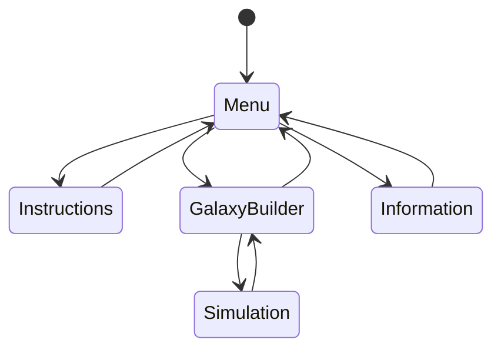
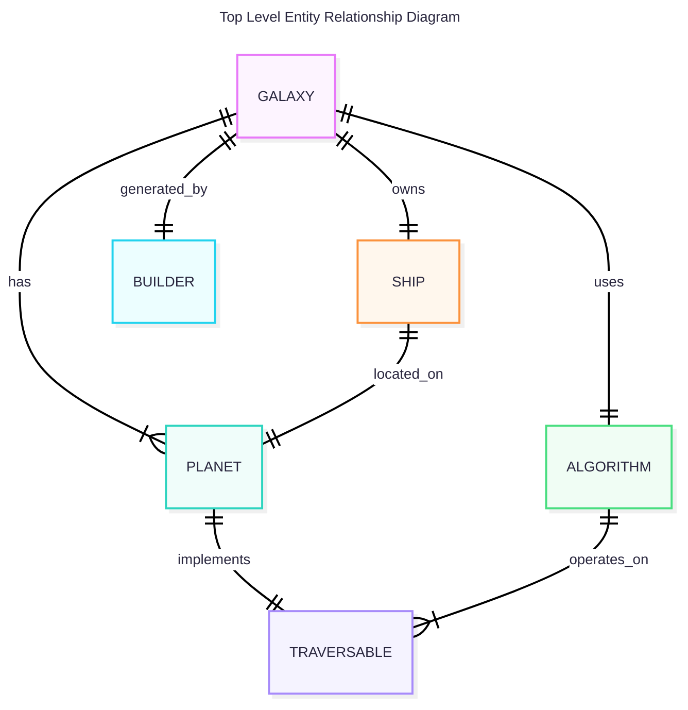
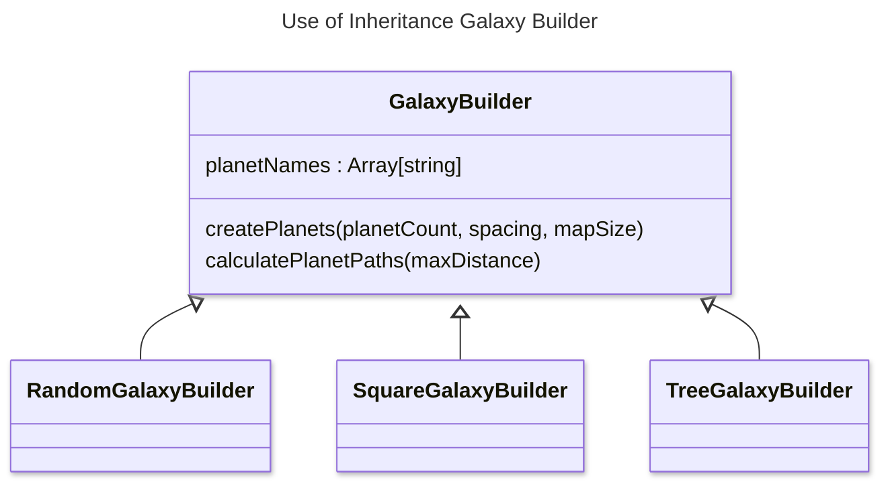
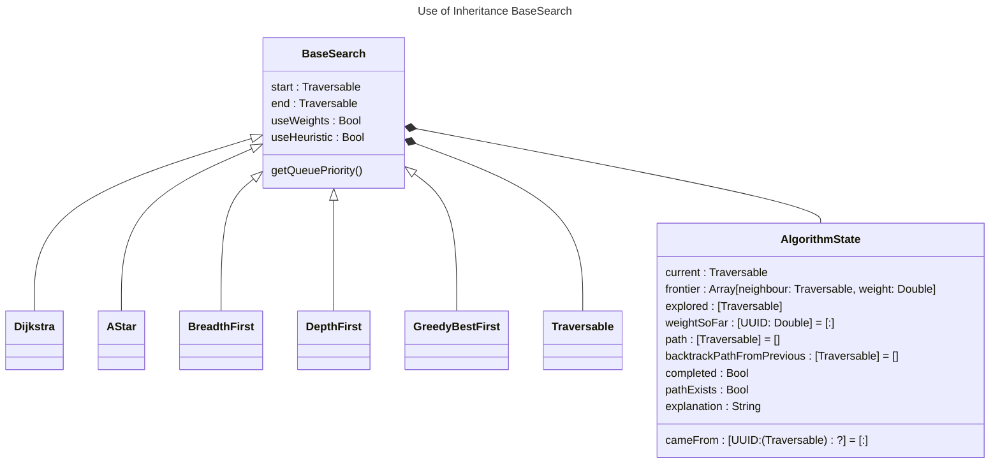

```swift
protocol Traversable: Identifiable {
    // This property requirement comes from Identifiable.
    var id: UUID { get }
    func getNeighbours()->[(neighbour : any Traversable, weight : Double)]
    func isEqual(to other: any Traversable) -> Bool
    func heuristic(to end: any Traversable) -> Double
    
}

// Example of comparitor implementedx as a closure
let sortedPaths = potentialPaths.sorted {
            return $0.distance<$1.distance
        }

```


| **Name :**<br><br>Noah Marks | **Candidate Number : 1146** |
| --- | --- |
| **Agenda :**<br><br>Engaging Graphing Simulator | **Centre Number :*10132* |


<!-- TODO: Mention Computer Science (CS) abbreviation -->

# A level Comp-Sci Writeup 

## Analysis

### Problem Recognition

The problem I am solving is the lack of fun ways to learn about certain Computer Science (CS) concepts, more specifically graphing algorithms.
Interactive simualtion's are usefull tools for learning as they can walk you through new concepts especially for STEM and Computer Science. Good learning also comes from relatable analogies and creative teaching methods. The flexibility of Coding allows you to express this creativity through a program. Therefore a computer simulation a suitible method to teach a topic like graphing algorithms 

From experience I have noticed that when looking for resources online to help learn a new concept there are a separation between the engaging resources which are often videos using creative analogies and the interactive tools used to model them which are often boring and difficult to use and stuck in the browser. This could be due to the relative difficulty to make a program compared to a video
I want to bridge that gap by creating a graphing algorithm simulator that uses a fun analogy of Space to keep the user engaged. From my research you will later see I beleve that space is an engaging subject for many people interested in computer science and even if they are not it is still a fun different way to 

Graphing algorithms are often found to be a difficult topic for Computer Science Students as they have not been exposed to these concepts before.
I will make a educational tool that aims to create a fun way for anyone to learn about graphing algorithms through space.
I will do this in the form of an app using Swift and SwiftUI.

### Analysing Other Solutions

**I have selected a few educational tools that aimed to create an interactive way to learn something. I tried out these tools and noted down the parts that I liked and disliked about them.**

#### Solution 1: Graph Online


This is a graphing simulator I found online. 
It lets you create a graph manually
The UI was quite tedious 
I thought it was frustrating making a graph manually and thought it would be especially not useful if this was your first time encountering a graph you may not know what graph to make.  
I found the options overwhelming and did not focus on anything specific. I thought It was more suitable for people more experienced with the basics. I want my project to be accessable to people who do not even know what a graph is.
It did not show you the steps of the algorithm and just solved it


#### Solution 2: TUM Shortest Path Algorithm


The University of Munich made a graphing algorithm visualisation and learning tool that I enjoyed

I liked how there were different tabs which separated learning about the algorithm, creating the graph and running the algorithm.
I liked the detailed descriptions of the steps and the visual colouring of the nodes an edges I found this to be importaing for the algorithm.
The graph creation was better than graph online and there started with a simple graph thay you could extend but still was quite limiting
My main complaint is that the program was not very engaging. The user had to read long paragraphs of text and the app was not ugly but wasnt super visually appealing.
It also did not have many of the simpler graph traversal alogrithm and only shortest path.

#### Solution 3: PhET Simulations

This is not a graphing simulator but it is an educational tool making learning interesting.
There are lots of different high quality simulations on this platform. 
PhET Is a non profit organisation founded by Carl Weiman. They have made their own framework for making simulations

I loved using this and found it very useful but one thing I would have liked is if it added a creative twist to it to keep the user engaged. As this is a large platform with lots of pI may want to use an anlaogy of some sort to make the program more relatable to use.

#### Research Takeaways

The main things I took away is that I wanted to make the program approachable and relatable to the user, intuitive to use and not rely on any knowledge fromthe user, this would make it accessible to my whole audience which is anyone seeking to learn about graphing algorihms. It 

### Stakeholders and Audience

My audience is anyone who is interested in learning about CS. This could be anyone from the age of 8 to 80 who is interested. This may seem like quite a broad audience due to the wide age range but I can slightly narrow it down to those who are more STEM focused.
Specifically I am targeting a younger audience as they are the future generation, and I want to create interest among the younger generation as they are still deciding what they are going to do with their lives. It is also true that this age group spends lots of time on mobile applications, playing video games or using computers so this may appeal more to them.

Therefore I feel like an app is the most accessible form to this audience

My stakeholders are mostly Students studying graphing algorithms for the first time in A-Level CS aswell as some GCSE students and some adults, as my goal is to make this tool accessible to people not activelly studying computer science.

I have interviewed these stakeholders and I aim to use this data to tailor the experience to be more engaging across my audience. I am going to refer back to these users as I develop the program.

### Questionnaire for target market

| **Which of the following subjects would you find most engaging for a learning tool.** | Space, Geographical or City |
| --- | --- |
| Stakeholder 1: Rambo| City |
| Stakeholder 2: Noah | Space |
| Stakeholder 3 : Rocco | Geographical Landscape |

| **When using a tool to learn a new subject would you rather.** | more freedom or a more guided path |
| --- | --- |
| Stakeholder 1: Rambo | More control would be nice but it should be easy/intuitive to use |
| Stakeholder 2: Noah | I would like both, maybe you could start with a more guided approach and then once you are more familliar you could be given more control |
| Stakeholder 3 : Rocco | I would rather be guided at the start as I can find the options overwhelming |

| **Which of the following analogies do you find most relatable and interisting** | Space, A Map (City or Rural) |
| --- | --- |
| Stakeholder 1: Rambo | I would love a space analogy |
| Stakeholder 2: Noah | The ruralMap would be cool but also the Space |
| Stakeholder 3 : Rocco | The Industrial Map would be cool but also the Space |


#### Client Questionnaire takeaways

I beleve a Space analogy will be the most suitable for the audience. This makes sense as my stakeholders are mostly into STEM so were already facinated by space.

I think it is importaint to have at least a slow introduction into the algorithms. From research of other games I found the solutions that had an easy onboarding to be more useful. My stakeholders backed this up.


### Features of Proposed solution

#### Usability

**Menu with Navigation across screens**
My app should allow the user to navigate between different screens. This should be intuitive and the user should not get lost.

**Clean Design**
I will make the apearance of the app minimal with clear controls.

Creation of graph

#### Performance
The simulation should be able to run on lower end older hardware. This will make it more accesable to more people.
The program should not abruptly crass

#### Bugs/Exploits
There should not be any Major bugs or exploits in the program.
As this would confuse/mislead the user.

#### Information/Teaching

As this is an educational tool everything needs to be factually correct.
After and during development.

I will also make small quality of life improvements that make explanations more true to what is actually happening

### Limitations of Solution

It may not be a very accurate simulation of the universe as there are many factors that are likely not included. Humans have not even explored another planet, so we do not know what it takes to explore a universe.

It may be hard to show how the algorithms involved work so the game can only educate the user on if they exist.

I may not have the capacity to add lots of levels so it may be limited to a tutorial and a main level.

### Using Computational Methods in the solution

#### Thinking Abstractly

I am going to use AI generated 2D sprites as this will not be time consuming and will be easy to implement while also providing an appealing aesthetic.

As My graphing simulator is set in space, I need to consider which features to keep to make the simulation at least somewhat accurate. This is a graphing simulator not an ultra-realistic space simulation so I am able to remove things without making the program useless to the user.
I will abstract lots of details of space and simplify it to just a graph with a few aesthetic objects in the backround for visual appeal.

I have looked at many aspects of space and noticed that there are many extra ideas that seem unnecessary and will overcomplicate the program. For example, adding planet Orbits would mean the nodes on the graph would have to move around. This not only complicates the development of the game but also adds extra complexities the user has to manage which would be frustrating, for example orbits would mean that the shortest path would be constantly changing. This would confuse the user which is a problem for an introduction to the subject.
Even though this may be unreasistic my planets are just going to be floating in space scattered randomly on a 2D plane.

I am going to remove aspects that do not add much value to the experience.
This might include 

#### Thinking Ahead
In each of the subcomponents of my game I am going to decide what are the inputs and outputs of my the function


#### Thinking Procedurally

I am going to break the game down into sub-systems to make it easier to write.
I will use a top down design when designing the archtecture


#### Thinking Logically
My App is going to be event driven so will do things in a logical order step by step.
I have to write lots of algorithms of varying complexity.

#### Thinking Concurrently

Lots of parts of my program will hapen at the same time. The ship will need to move, the galaxy will need to be generated, the paths will need to be found

### Choosing a Framework

| **Platform** | **Description** | **Pros** | **Cons** |
| --- | --- | --- | --- |
| Unity/Unreal | Game engines will provide me with<br><br>Some examples of game engines I could use are Godot, Unity and Unreal Engine. | I could make the game 3D however my game<br><br>Lots of lower-level UI interactions, e.g. panning, can be managed by the engine.<br><br>Lots of functionality is pre-baked into the engine meaning I will not have to code these elements. However this will mean that I have less control over the game which is a negative. | A game engine can be overly complex for my simple game, they are best for games involving more complex graphics |
| Godot | Godot is a lightweight Game engine used for both 2D and 3D games | Very lightweight and simple to use.<br><br>I can write in GDScript which is a simple language based of python but can still be statically typed for efficiency.<br><br>I can easily export to many different platforms |     |
| Swift / SpriteKit | Swift is Apples programming language and SpriteKitis a simple graphics API I could use with it to make my game. SpriteKit is still feature ritch and powerful with their Node System and SKActions. | I could make my game work on all apple devices such as tablets and phones which is a more convenient way.<br><br>It will be more efficient as swift is statically typed meaning it will be more optimised by the compiler | The game will not be playable on other platforms like android or windows as will be exclusively iOS. |
| Pygame | Pygame is a simple 2D graphics library that uses python. | I can write the game in python which has easy syntax and is quite lightweight. | It is very basic so I will have to program algorithms like shortest path from scratch |
| Defold | Defold is a simple Game Engine that uses Lua |     |     |

#### Choice

The main three contenders are Swift / SpriteKit, Pygame and Godot.

After considering the benefits and drawbacks of each framework I have swift for my project. I will specifically be using SpriteKit for the game's graphics and SwiftUI for the controls and User Interface. I like the simplicity of this as it means I have more control over my game. Another main factor in my decision means I can program it in swift which is a strongly typed language meaning great efficiency compared to something like using python with pygame which was a close second choice. I prefer this over a game engine which would require me to code in C# or C++ which are more complex.

However this will mean that the app can only be played on apple devices, this could be a good start as they are popular with my audience. I found it is also quite difficult to have an android version aswell as I would need to rewrite it due to the specific frameworks I have selected. It may have been more accessible if I made a webapp

### System Requirements
#### Hardware

My game will be played on either a computer, tablet or a mobile device.
As I am using SwiftUI it will have to be an apple device such as an iPad, Mac or iPhone

| **Requirement** | **Reason** |
| --- | --- |
| Computer Mouse or touchscreen | Used for selecting objects and playing the game |

#### Software

| **Requirement** | **Reason** |
| --- | --- |
| Runs macOS, iOS, iPadOS | Swift, SwiftUI and SpriteKit only works on these operating systems |

### Success Criteria

| **Criteria** | **Reason** |
| Teach what a graphing algorithm is | The  |
| Show the uses of graphing algorithms | The user should know what graph graphs and graph traversal algorithms are used for (e.g maps)|
| Simulate a variety of graphing algorithms on a variety of graphs | I need to show that there is a range of graphing algorithms that are used and their benifits and drawbacks. A variety of graphs will be better as different algorithms work better for different graphs |


## Design

### Problem Decomposition

I have broken down my problem into the following subcomponents.
When deveoping I will do sprints for each of these components.

TODO: Put in Hierarchy Diagram

#### Subcomponents
At a very high level, this are the six subcomponents I'm going to divide the problem into:

* **Graph generation** : This generates a random graph of planets for algorithms to solve
* **Graph rendering** : this will be a UI compontent that will show the graph visually as planets in a galaxy
* **Algorithm Solving** : this will implement all the Graph Traversal algorithms from A Level Computer Science
* **Algorithm Control** : this will store the state of an algorithm to allow users to step back and forwards through the solution
* **Algorithm Visualisation** : this is add more information to the graph rendering interface to show progress through the algorithm
* **User Interface** : this is how the user interacts with the app and navigates between the screens


### In depth components of Solution
Here is an in depth summary of each of the components of my solution
 
#### Subcomponent One : Random Galaxy/Graph generation
##### Description
Generates a undirected graph that the algorithms can operate on and the spacship can move between. Each node will be a planet in the graph which knows its neighbours. I will start simpler by using an unweighted graph (or all the weights equal to one) and then add weights later for neccessary algorithms. To keep with the analogy I will call the weights fuel needed.
This will also include choosing a start planet and an end planet. The graph does not neccessarily have to be solvable 
##### Inputs
Number of Planets, Connection Length
##### Outputs
Graph with connected nodes or planets
##### Validation
At least two planets and up to a sensible limit which will be decided.	The start and end planets should not be the same planet.

Learnings (things added later)
Non random test galaxies
Edges should not intersect as it makes it hard to visualise. This is why i introduced the checklines
Implemnt in future: 
The start and end planets should be a reasonable distance from each other to prevent graphs being solved too quickly and start planet has neighbours


#### Subcomponent Two : Graph Rendering
##### Description
Now that I have a graph which are nodes that store their positions and know their neighbours I need a way to visualise them
The first part of this is to add circles to the correct coordinates and lines showing the connections for edges.
The graph also needs to give an interface that alows external classes to access the colors of nodes and edges aswell as other effects and info about the node. This will mean that when writing the algorithm it will be easy to change the visuals for the user.

#### Subcomponent Three : Algorithm Solving
##### Description
I will make a simple graph traversal algorithm such as Breadth First Search and Depth Firt Search to traverse the graph and find a path from the start to the finish.
It will record neccessary data such as the queue or stack of nodes to visit next aswell as the visited nodes.
I plan to then implement the rest of the algorithms in the A-level specification including dijkstra and A* using a heuristic of distance to target.
I will not have a UI at this stage but plan to visualise data in the console or debugger.
##### Inputs
A graph
##### Outputs
A solved graph storing the backtrace path taken to get from start to finish it should also be able to report if it is solvable
##### Validation

#### Subcomponent Four : Algorithm Control
##### Description
The first part of the problem is just solving the algorithm instantly however I want the user to see each stage of the solving along with the state of the variables being used at this time. The user should be able to easily use this to make a trace table for the solving of the algorithm. This is because this is meant to be a learning tool not just a graph solver.
The ability to undo and redo
##### Inputs
Graph Algorithm
##### Outputs
Step by step state of graph algorithm
##### Validation
Not Undo at the first stage and redo at the last stage

##### Undo/Redo Stack
One of my requirements is that the user should be able to replay the steps of the algorithm
Anouther Requirement is that my program is efficeint to optimise performance on less powerful devices.
To implement this I am going to use a stack that stores the state.

I will create a data structure that saves the state of the algorithm
When Moving forwards a step I wil push the importaint data of the algorithms state onto a stack.
When Undoing a step I will pop the top of the stack and 
However for this I need to reacalculate the steps when going forwards but not backwards.
To fix this I could make anouther stack that stores the next instructions
together these two stacks and current state will store all the possible states of the algorithm.
When moving forwards I will pop the current state from the forwards stack and when going backwards I will push the current state on the forwards stack.

This will mean I calculate all the possible states at the start.

| **Option** | **Description** | **Benifits** | **Drawbacks** |
| --- | --- | --- | --- |
|     | Un |     |     |


#### Subcomponent Five : Algorithm Visualisation
##### Description
Now that I have data for all the states of the algorithm I need to be able to display it to the user.
In this section I will heavily use the interface I created for the graph changing colors.
I will also create lists and other UI elements to help display algorithm state and other factors.
I am also going to add a spaceship that shows the current node
##### Inputs
A graph that provides a interface for changing visuals, UI elements
The Algorithm State
##### Outputs
A visual display of the state of the algorithm
##### Validation


#### Subcomponent Six : User Interface
##### Description
This component is not to do with the main program but is about the app as a whole. I want a easily navigatable UI that will show all the different screens and should be intuitive to use.
##### Inputs
##### Outputs
##### Validation


### System Overview / Architecture

I will use the Model View Controller design pattern to separate the components of my app.

**Explain diagram and high level of components, Model veiw controller**

#### Model (Data Structures)
As I am using the Model View Controller Pattern I am going to keep the data in the Model.
This will ensure there is a single source of truth which ensures consistancy of data.
I am going to use an Observable Object which is a *"A type of object with a publisher that emits before the object has changed."*
This means when changing the objects properties it will update any views using the data.

#### View (User Interface)

##### Navigation
As I am going to allow the user to navigate around different Views.
I am going to use SwiftUI's Navigation stack for this.
As I want to have control and stylise my app I am not going to be using Apples built in components and will heavily customise them.

These screens should include:
* Menu (for selection)
* How to use (explains how to use the program)
* About Graphs (Teaches the user about graphs using a text page (not the simulation)
* Graph/Galaxy Builder (Allows the user to create/select/generate graph)
* Simulation (Performs the Graph Traversal Algorithms on the generated graph
Here is a short graph of how these screens will interact

##### Adaptability
The User Interface needs to be able to adapt to different screen sizes. Although iPads are all the same 4:3 aspect ratio they can be rotated to be in portrait and my app still needs to work. It should also work on Mac's, iPhones and Headsets. If it is being windowed the size should adapt similar to a web page
I therefore should make sure my app can adjust the size and locations of UI elements to fit and not obscure the screen.

##### Validation of input data

#### Controller (Program Logic)


### Algorithms

Throught the program I will use variety of algorithms
#### Simple Algorithms
##### Sorting


#### Graph Algorithms
##### Breadth First Search (BFS)

##### Depth First Search (DFS)

##### Dijkstra's shortest path

##### A* shortests path


### Test Data

When writing the algorithms In order to debug and ensure they are working as intended I will need to make graphs that will produce different outcomes for each algorithm. I wrote some down on paper and manually solved them step by step using a trace table. When developing I will compare the state with the expected state to make sure they work.
These test graphs looked more strange as the length of the paths were not what determined the weight. In my random graph generation the weights will be proportional to the distance between the nodes (with some random noise for variation).

### Further Post Development Test Data


### Objects

| **Object** | **Overview** | **Update Logic** | **Render** |
| --- | --- | --- | --- |
|     |     |     |     |








## Development

### Stage One - **Random Galaxy Generation**

#### Generation

My first task was to randomly generate a graph/galaxy. This would consists of nodes/planets and edges which connect the path.

* My objectives is that each galaxy should feel random and different. 
* You should have some control over the graph structure without having to micromanage nodes
* Select the Number of nodes in the graph and lengths of paths
* The graph should look visually appealing and look like a galaxy

I started by using a nested for loop to create a square grid of possible positions for a planet and I added these to a array. I need to select a fixed number of positions from this list of positions. To do this I randomised the order of the planets array and selected the first planetCount of this array.

I then

Here is the create Planets for random galaxy
```swift
override class func createPlanets(planetCount: Int, spacing : Double = 100, mapSize : Double = 1000)->[Planet]{
        var planets : [Planet] = []
        var options : [CGPoint] = []
        let jitter = Int(spacing/10)
        let offset : Double = 50
        for y in stride(from: -mapSize/2, to: mapSize/2, by: spacing){
            for x in stride(from: -mapSize/2, to: mapSize/2, by: spacing){
                options.append(CGPoint(x: x+offset, y: y+offset))
            }
        }
        options = options.shuffled()
        var planetNamesShuffled = planetNames.shuffled()
        
        for i in 0...min(planetCount, options.count)-1{
            var name = "No Name \(i)"
            if !planetNamesShuffled.isEmpty{
                name = planetNamesShuffled.removeFirst()
            }
            var offsetPos = options[i]
            offsetPos.x += CGFloat(Int.random(in: -jitter...jitter))
            offsetPos.y += CGFloat(Int.random(in: -jitter...jitter))
            
            let planet = Planet(position: offsetPos, name: name)
            planets.append(planet)
        }
        return planets
    }

```

#### CheckLines
After Creating the random galaxy generator I realised there were lots of intersections of edges in the graph. The edges went through planets. This looked ugly and could be confusing to the user.

In order to delete edges and I need to decide which edges to delete.
I decided to keep the shorter edges and remove the longer edges that intersect with the shorter edges.

To fix the Lines going through planets  I thought of putting edges across the planet nodes. This meant that when an edge passed through a planet it would be deleted.
However when developing this I encountered a bug that caused edges that ... to be deleted
The fix to this was to put 4 edges from the centre of the planet to the circumference.

Here is a function on the planet that returns the checklines
```swift
func getCheckLines()->[(start: CGPoint, end: CGPoint)]{
        let horizontalFirst = (start: CGPoint(x: self.position.x-planetRadius, y: self.position.y), 
                               end: CGPoint(x: self.position.x, y: self.position.y))
        let horizontalSecond = (start: CGPoint(x: self.position.x, y: self.position.y), 
                                end: CGPoint(x: self.position.x+planetRadius, y: self.position.y))
        
        let verticalFirst = (start: CGPoint(x: self.position.x, y: self.position.y-planetRadius), 
                             end: CGPoint(x: self.position.x, y: self.position.y))
        let verticalSecond = (start: CGPoint(x: self.position.x, y: self.position.y), 
                              end: CGPoint(x: self.position.x, y: self.position.y+planetRadius))
        let checkLines : [(start: CGPoint, end : CGPoint)] = [horizontalFirst, horizontalSecond, verticalFirst, verticalSecond]
        return checkLines
    }
```
#### Intersection Algorithm using Orientation

To check if two lines intersect I did some research online and found an algorithm that uses orientation to check if two lines intersect. I used an article from GeeksforGeeks to help understand the concepts before implementing it

To deterimine the orientation of a line I used the sign of the cross product.
Here is the code I used to check two lines intersect

#### Minor improvements to prior stages

### Stage Two - **Implementing Search Algorithms**

I made my Search Algorithms all inherit from a Generic BaseSearch class.
This acted partly like a protocol as it defined the functions the child classes should have. However the base search implemented some basic generic functionality that was overriden when neccessary.

#### Undo/Redo Stack

I made a stack to store the histor

#### Algorithm Backtracking

After implementing the search algorithms I realised algorithms that used backtracking would do large jumps across the graph. I thought this was unclear and may be confusing for my target audience. I wanted to implement a feature that showed the nodes the spaceship backtracks to on the way to the next node.
To do this I made each node store the node which the ship came from.

#### Minor improvements to prior stages

### Stage Four - **Adaptive User Interface**

My User Interface needs to adapt and scale to fit different sized screens by looking consistant. visible and unintrusive for different devices. During this stage I used my ipad mini a lot for testing and tested using different window sizes on my laptop. 
Overall I found this to be harder than expected.

#### Minor improvements to prior stages


## Evaluation

## Sources

Orientation Algorithm For Line Intersection
https://www.geeksforgeeks.org/dsa/check-if-two-given-line-segments-intersect/


https://www.ocr.org.uk/Images/324587-project-setting-guidance.pdf
https://www.ocr.org.uk/images/170844-specification-accredited-a-level-gce-computer-science-h446.pdf
