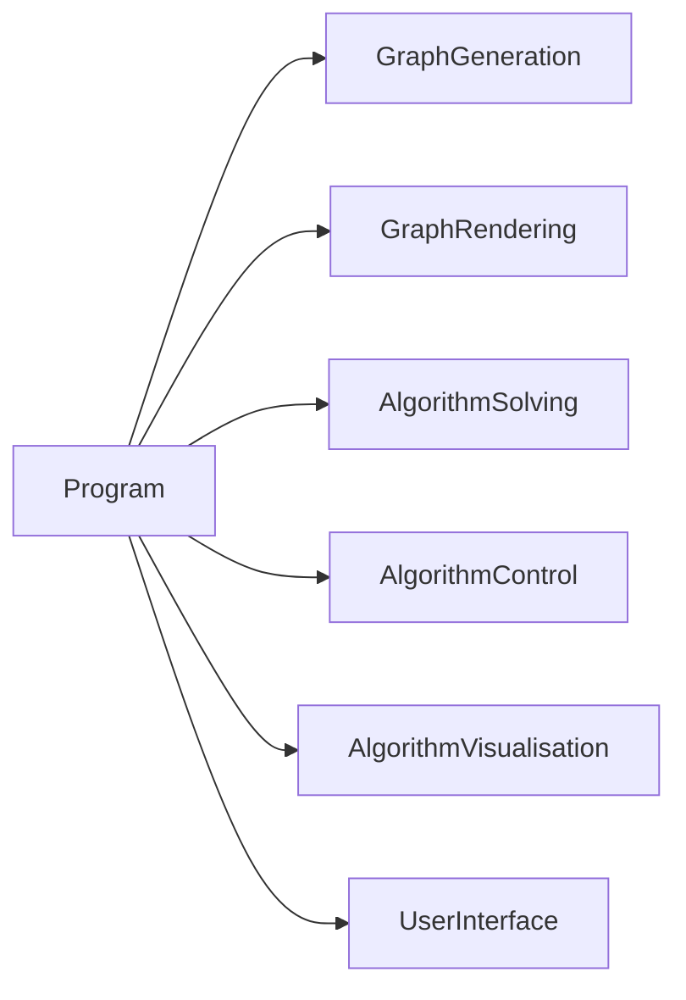
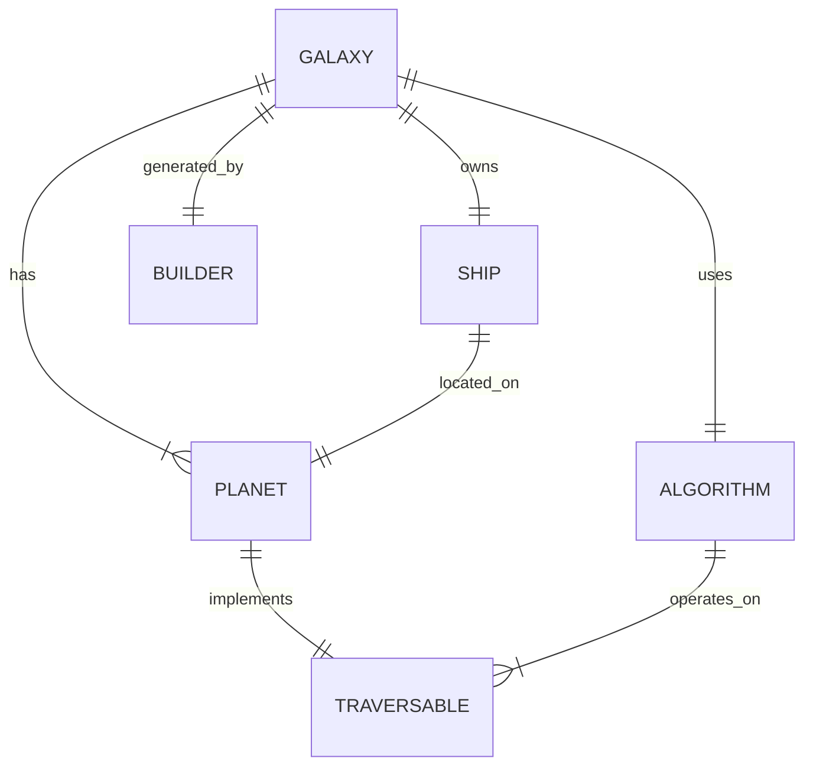
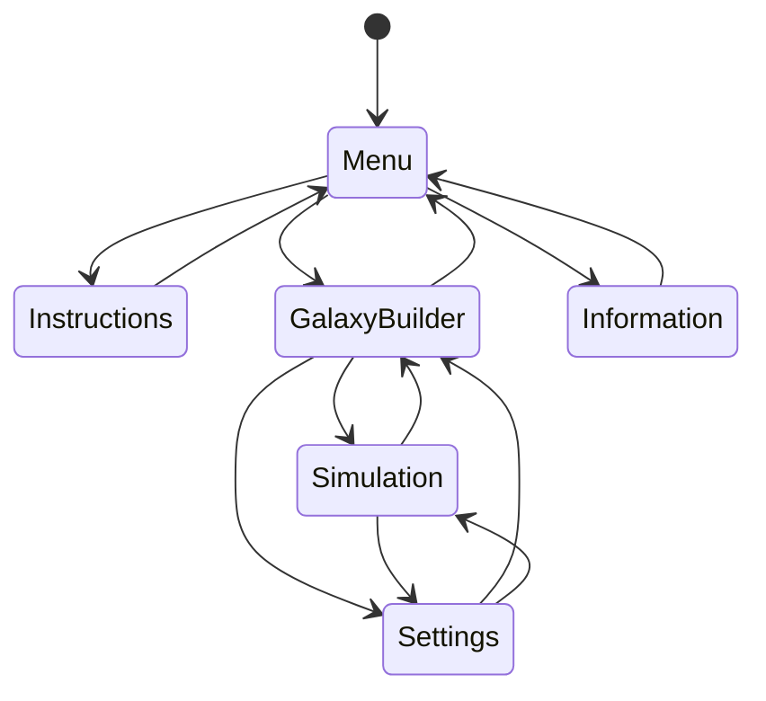
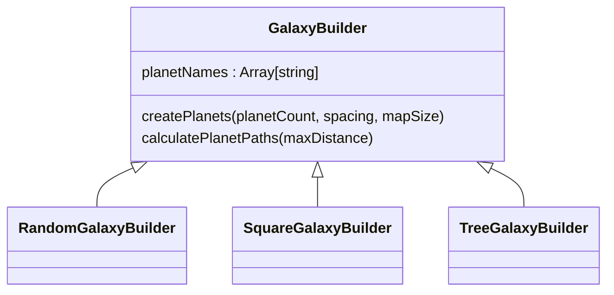
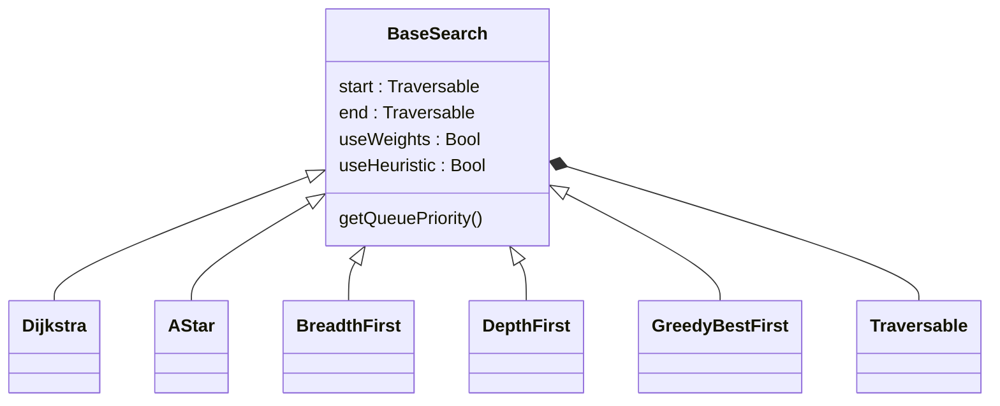
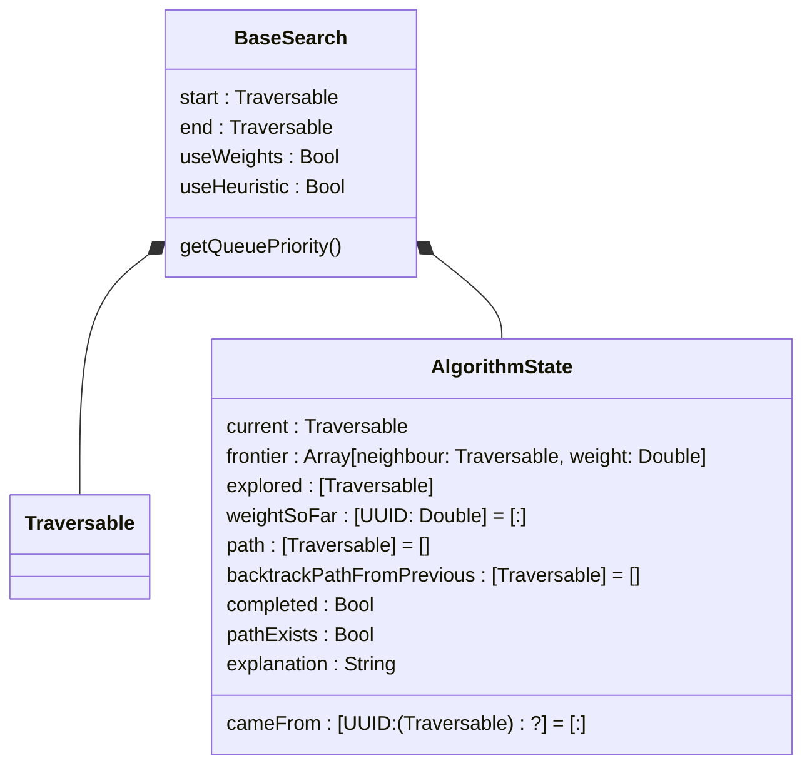

# A Level Comp-Sci Write-Up

| **Name :**Noah Marks                        | **Candidate Number : 1146** |
| ------------------------------------------- | --------------------------- |
| **Agenda :**<br>Engaging Graphing Simulator | **Centre Number : 10132**   |
## Analysis

### Problem Recognition

The problem I am solving is the lack of fun ways to learn about certain Computer Science (CS) concepts, more specifically graph algorithms.
Interactive simulations are useful tools for learning as they can walk you through new concepts, especially for STEM and Computer Science. Good learning also comes from relatable analogies and creative teaching methods. The flexibility of coding allows you to express this creativity through a program. Therefore, a computer simulation is a suitable method to teach a topic like graph algorithms.

From experience I have noticed that when looking for resources online to help learn a new concept there is a separation between the engaging resources, which are often videos using creative analogies, and the interactive tools used to model them, which are often boring, difficult to use, and stuck in the browser. This could be due to the relative difficulty of making a program compared to a video.
I want to bridge that gap by creating a graph algorithm simulator that uses a fun analogy of space to keep the user engaged. From my research, which I will refer to later, I believe that space is an engaging subject for many people interested in computer science and, even if they are not, it is still a fun and different way to explore the algorithms.

Graph algorithms are often a difficult topic for Computer Science students as they have not been exposed to these concepts before. I will make an educational tool that aims to create a fun way for anyone to learn about graph algorithms through space. I will do this in the form of an app using Swift and SwiftUI.

### Analysing Other Solutions

I have selected a few educational tools that aimed to create an interactive way to learn something. I tried out these tools and noted down the parts that I liked and disliked about them.

#### Solution 1: Graph Online [[https://graphonline.top/]]


This is a basic graphing simulator I found online. 
It lets you create a graph manually, to do this there were a few tools: panning, dragging, adding nodes, adding edges and more.
The UI was quite tedious, especially when moving nodes and edges or creating a connection between two nodes, where there is a menu for selecting weights and direction.
I thought it was frustrating to make a graph manually and that it would be unhelpful if this was your first time encountering a graph, because you may not know what graph to make.  
I found the options overwhelming and not focused on anything specific. I thought it was more suitable for people who were already familiar with the basics. I want my project to be accessible to people who do not even know what a graph is.
It did not show you the steps of the algorithm and just solved it, which I believe is important for understanding the algorithm.

#### Solution 2: TUM Shortest Path [[https://algorithms.discrete.ma.tum.de/spp/]]


The University of Munich made a graph algorithm visualisation and learning tool that I enjoyed.

I liked how there were different tabs which separated learning about the algorithm, creating the graph, and running the algorithm.
I liked the detailed descriptions of the steps and the visual colouring of the nodes and edges. I found this to be important for the algorithm simulation.
The graph creation was better than Graph Online and it started with a simple graph that you could extend, but it was still quite limiting.
My main complaint is that the program was not very engaging. The user had to read long paragraphs of text and, while the site was not ugly, it was not especially visually appealing.
It also did not have many of the simpler graph traversal algorithms (like BFS and DFS) and only shortest path.

#### Solution 3: PhET Simulations ([[https://phet.colorado.edu/]])

This is not a graphing simulator but it is an educational tool making learning interesting.
There are lots of different high quality simulations on this platform. 
PhET Is a non profit organisation founded by Carl Weiman. They have made their own framework for making simulations.
I loved using this and found it very useful but one thing I would have liked is if it added a creative twist to keep the user engaged. As this is a large platform with lots of similar simulations I would have liked something more unique to make the program more relatable to use.

#### Research Takeaways
The main things I took away is that I wanted to make the program approachable and relatable to the user, intuitive to use and not rely on any knowledge from the user, this would make it accessible to my whole audience which is anyone seeking to learn about graphing algorithms. 

### Stakeholders and Audience
My audience is anyone who is interested in learning about CS. This could be anyone from the age of 8 to 80 who is interested. This may seem like quite a broad audience due to the wide age range, but I can narrow it slightly to those who are more STEM focused.
Specifically I am targeting a younger audience, as they are the future generation, and I want to create interest while they are still deciding what they are going to do with their lives. It is also true that this age group spends lots of time on mobile applications, playing video games, or using computers, so this may appeal more to them. For my stakeholders I tried to find Computer Science students, who will likely study graph algorithms, doing A-Levels or GCSEs, as well as an adult, as my goal is to make this tool accessible to people not actively studying computer science.

I interviewed these stakeholders and I aim to use this data to better understand my audience and tailor the experience to be more engaging to them. I am going to refer back to these users once I have developed the app.

### Questionnaire for target market

Rambo
Rocco
Jon
Willow

How Long are you willing to spend to learn a new topic
20 minuites for something small
half an hour
40 minuites, just under a lesson
1 school period or an hour

What devices do you use the most to learn (Tablet, Phone, Desktop or other)
I got a ipad 9th gen which I use for work
I use a m2 macbook pro
I have a m2 macbook air
Mac Mini desktop for work

Are you studying computer science, if so what course
GCSE OCR computer Science
OCR comp-sci A-Level
A level Computer Science
I am not studiying computer science but still am interseted in a graph learning tool

When using a tool to learn a new subject would you rather have more freedom or a more guided path.
Which of the following analogies do you find most relatable and interisting : Space, A CityMap or A RuralMap


| **When using a tool to learn a new subject would you rather.** | more freedom or a more guided path                                                                                                        |
| -------------------------------------------------------------- | ----------------------------------------------------------------------------------------------------------------------------------------- |
| Stakeholder 1: Rambo                                           | More control would be nice but it should be easy/intuitive to use                                                                         |
| Stakeholder 2: Noah                                            | I would like both, maybe you could start with a more guided approach and then once you are more familliar you could be given more control |
| Stakeholder 3 : Rocco                                          | I would rather be guided at the start as I can find the options overwhelming                                                              |

| **Which of the following analogies do you find most relatable and interisting** | Space, A Map (City or Rural)                        |
| ------------------------------------------------------------------------------- | --------------------------------------------------- |
| Stakeholder 1: Rambo                                                            | I would love a space analogy                        |
| Stakeholder 2: Noah                                                             | The ruralMap would be cool but also the Space       |
| Stakeholder 3 : Rocco                                                           | The Industrial Map would be cool but also the Space |

| **Which of the following subjects would you find most engaging for a learning tool.** | Space, Geographical or City |
| ------------------------------------------------------------------------------------- | --------------------------- |
| Stakeholder 1: Rambo                                                                  | City                        |
| Stakeholder 2: Noah                                                                   | Space                       |
| Stakeholder 3 : Rocco                                                                 | Geographical Landscape      |

#### Client Questionnaire takeaways

I believe a space analogy will be the most suitable for the audience. This makes sense as my stakeholders are mostly into STEM, so they were already fascinated by space.
I think it is important to have at least a gentle introduction to the algorithms. From research into other tools I found the solutions that had an easy onboarding to be more useful, and my stakeholders backed this up.
I think that 30 minutes is a suitable length of time for the user to spend on the program. This is close to the length of a school lesson and I believe it will take slightly longer than they first expect.
Therefore I feel like an app is the most accessible form for this audience, especially as the stakeholders seem to be using Apple devices.

**TODO:** improve this section by linking each takeaway more directly to a design decision.
### Using Computational Methods in the solution

#### Thinking Abstractly

I am going to use AI generated 2D sprites as this will not be time consuming and will be easy to implement while also providing an appealing aesthetic.

As My graphing simulator is set in space, I need to consider which features to keep to make the simulation at least somewhat accurate. This is a graphing simulator not an ultra-realistic space simulation so I am able to remove things without making the program useless to the user.
I will abstract lots of details of space and simplify it to just a graph with a few aesthetic objects in the backround for visual appeal.

I have looked at many aspects of space and noticed that there are many extra ideas that seem unnecessary and will overcomplicate the program. For example, adding planet Orbits would mean the nodes on the graph would have to move around. This not only complicates the development of the game but also adds extra complexities the user has to manage which would be frustrating, for example orbits would mean that the shortest path would be constantly changing. This would confuse the user which is a problem for an introduction to the subject.
Even though this may be unreasistic my planets are just going to be floating in space scattered randomly on a 2D plane.

I am going to remove aspects that do not add much value to the experience.
This might include 

#### Thinking Ahead
In each of the subcomponents of my game I am going to decide what are the inputs and outputs of my the function

#### Thinking Procedurally

I am going to break the game down into sub-systems to make it easier to write. When developing I will work on each component individually.
I will use a top down design when designing the architecture.

#### Thinking Logically
My simulator is going to be event driven so will do things in a logical order step by step.
I have to write lots of algorithms of varying complexity.

#### Thinking Concurrently

Lots of parts of my program will hapen at the same time. The ship will need to move, the galaxy will need to be generated, the paths will need to be found. This will mean that I need to do things asynchronously. There will be lots of objects in the game running functions continuously. This means that there will be multiple threads running at once which should be handled by the engine I use.

### Choosing a Framework

| **Platform**                                | **Description**                                                                                                                                                                                     | **Pros**                                                                                                                                                                                                                                       | **Cons**                                                                                                                                                                                                                                                                                                                          |
| ------------------------------------------- | --------------------------------------------------------------------------------------------------------------------------------------------------------------------------------------------------- | ---------------------------------------------------------------------------------------------------------------------------------------------------------------------------------------------------------------------------------------------- | --------------------------------------------------------------------------------------------------------------------------------------------------------------------------------------------------------------------------------------------------------------------------------------------------------------------------------- |
| [Unity](https://unity.com/)/Unreal          | Game engines will provide me with<br><br>Some examples of game engines I could use are Godot, Unity and Unreal Engine.                                                                              | I could make the program 3D however my game<br><br>Lots of lower-level UI interactions, e.g. panning, can be managed by the engine.<br><br>Lots of functionality is pre-baked into the engine meaning I will not have to code these elements.  | A game engine like this can be overly complex for my program , they are designed for video games involving more complex graphics. <br><br>I will have less control over the program if it is using pre-made functions which means I don't write as many algorithms. For a unique project like graphing I would want more control. |
| [Godot](https://godotengine.org/)           | Godot is a lightweight Game engine used for both 2D and 3D games                                                                                                                                    | Very lightweight and simple to use.<br><br>I can write in GDScript which is a simple language similar of python but can still be statically typed for efficiency.<br><br>I can easily export to many different platforms including ios devices | Like Unity, this is probably overkill<br><br>Too many functions provided in the framework so less algorithms to write                                                                                                                                                                                                             |
| [Swift](https://www.swift.org/) / SpriteKit | Swift is Apples programming language and SpriteKitis a simple graphics API I could use with it to make my game. SpriteKit is still feature ritch and powerful with their Node System and SKActions. | I could make my app work on all Apple devices such as tablets and phones which is a more convenient for my target audience.<br><br>It will be more efficient as Swift is statically typed meaning it will be more optimised by the compiler    | The game will not be playable on other platforms like Android or Windows as will be exclusively iOS.                                                                                                                                                                                                                              |
| [Pygame](https://www.pygame.org/)<br>       | Pygame is a simple 2D graphics library that uses python.                                                                                                                                            | I can write the project in Python which has easy syntax and is quite lightweight.                                                                                                                                                              | It is very basic so I will have to program all user interface components from scratch                                                                                                                                                                                                                                             |


#### Choice

The main three contenders are Swift / SpriteKit, Pygame and Godot.

After considering the benefits and drawbacks of each framework I have decided to use Swift for my project. I will specifically be using SpriteKit for the graphics and SwiftUI for the controls and User Interface. I like the simplicity of this as it means I have more control over my game. Another main factor in my decision means I can program it in Swift which is a strongly typed language meaning great efficiency compared to something like using python with Pygame which was a close second choice. I prefer this over a game engine which would require me to code in C# or C++ which are more complex.

However this will mean that the app can only be played on Apple devices, this could be a good start as they are popular with my audience. I found it is also quite difficult to have an Android version as I would need to rewrite it due to the specific frameworks I have selected. It may be more accessible if I make a Web App but Swift does not allow this.

### System Requirements

#### Software

| **Requirement**                        | Description                                                                                                                                  | **Justification**                                                                                                                                |
| -------------------------------------- | -------------------------------------------------------------------------------------------------------------------------------------------- | ------------------------------------------------------------------------------------------------------------------------------------------------ |
| Runs macOS, iOS, iPadOS, VisionOS      | As I am using Swift/SwiftUI it will have to run an apple operating system.                                                                   | Swift, SwiftUI and SpriteKit only works on these operating systems                                                                               |
| MacOS Sonoma 14.5 or iOS 17.5 or later | I cannot support all versions of the OS so I need to decide how far back I can go                                                            | For iOS/MacOS is reccomended that you support the last version and two preceeding. Apple devices tend to be well within the last two OS versions |
| Mac Catalyst 17.5                      | This is only related to MacOS but Mac Catalyst makes a version of my ipad App that works on Mac. Mac catalyst 17.5 corresponds to MacOS 14.5 | I am developing for iOS so I need to be able to convert it to a version that can run on Mac                                                      |
|                                        |                                                                                                                                              |                                                                                                                                                  |
#### Hardware

| **Requirement**               | Description                                                                                                                                                                                                                                          | **Justification**                                                                                    |
| ----------------------------- | ---------------------------------------------------------------------------------------------------------------------------------------------------------------------------------------------------------------------------------------------------- | ---------------------------------------------------------------------------------------------------- |
| Computer Mouse or touchscreen | The device they use must be a touchscreen, or have a screen and mouse or trackpad or some mechanism to view and select elements                                                                                                                      | Used for selecting objects and playing the game                                                      |
| Apple Device                  | It must be an apple device such as an iPad, Mac or iPhone                                                                                                                                                                                            | The device needs to run a required operating system                                                  |
| Screen Aspect Ratio/Size      | I will not be too strict about the aspect ratio but it should not be too wide or too small. I am going to test it using an Ipad and a mac which have 3:2 and 16:10 aspect ratio so it will be designed around that aswell as 2:3 for portrait ipads. | Most users will be running this on ipads or macs so optimising for these aspect ratios is importaint |
| RAM                           | 8gb                                                                                                                                                                                                                                                  | Firstly I need to be able to run swift playgrounds.                                                  |
|                               | My program is not storign much data                                                                                                                                                                                                                  |                                                                                                      |

### Features of Proposed solution

| Feature                                                   | Explanation                                                                                                               | Reason                                                                                                                                                                                 |
| --------------------------------------------------------- | ------------------------------------------------------------------------------------------------------------------------- | -------------------------------------------------------------------------------------------------------------------------------------------------------------------------------------- |
| An app with navigatable screen                            | Aswell as the simulation I will need a app with navigation                                                                |                                                                                                                                                                                        |
| Generating the graph                                      | The program should automatically generate a  simple graph with few user inputs this will mean that the user does not need | I need a graph to perform the search algorithms on                                                                                                                                     |
| Visualising the Graph                                     | There should be a user interface that allows the user to interact with the graph                                          | In order to understand the graph it is important to see the graph. Graphing algorithms can still be done without seeing the nodes and edges but for a learning tool this is importaint |
| Performing Search Algorithms on Graph<br>                 | This may seem obvious but I need to be able to run the algorithms on the graph                                            | To simulate the algorithms I must be able to programmatically solve them                                                                                                               |
| Step By Step through the Graph                            | I need to be able to run each algorithm slowly to explain the algorithm                                                   | The user should be able to pause the algoritm and in theory make a trace table of the key variables of the algorithm.                                                                  |
| Explanations and Visualisation of graph being operated on | I will have text boxes explaining what is happening at each step                                                          | I need to also explain what is happening at each step.                                                                                                                                 |
### Limitations of Solution

| Limitation                         | Explanation                                                                                                                                         | Justification                                                                                                                                                                                                                  |
| ---------------------------------- | --------------------------------------------------------------------------------------------------------------------------------------------------- | ------------------------------------------------------------------------------------------------------------------------------------------------------------------------------------------------------------------------------ |
| Simplicity                         | The program will have a easy to use simple interface                                                                                                | As I am targeting to make the simulator accessable and focussed on introducing to graphs it is naturally going to be less feature rich and the user will not have full control over the program.                               |
| Less Control over Graph Generation | As I am quickly generating the graph with minimal inputs It means the user will not be able to have the control to create the exaxt graph they want | Giving more control t the user will make it more complicated to use. It is not targeted at experienced people simulating lots of graphs to test efficiency or testing unusual cases on algorithms. It is more a learning tool. |
| No Saved Data                      | I have not included the ability to store app data.                                                                                                  | I couldnt find enough features and reasons to store user data. There are no major practical benifits and the user likely prefers not to be tracked.                                                                            |

### Other Requirements
#### Usability Requirements
##### Menu with Navigation across screens
My app should allow the user to navigate between different screens. This should be intuitive and the user should not get lost.
##### Clean Design
I will make the appearance of the app minimal. 
I will have clear controls with suitable labels explaining what they do.
##### Performance
The simulation should be able to run on lower end older hardware. This will make it more accessible to more people.
The program should not abruptly crash. It should not be too processeur intensive so it should be fast to run with decent frame rates, not drain the devices battery life and boot up quickly. I do not want performance to be an issue as it is importaint that the user enjoys using the program.

##### Bugs/Exploits
There should not be any Major bugs or Exploits in the program.  
My focus will be on minimising bugs that are accidentally triggered that cause unexpected behaviour as this would confuse/mislead the user. 

#### Information/Teaching

As this is an educational tool everything needs to be factually correct.
After and during development.
I will also make small quality of life improvements that make explanations more true to what is actually happening

**TODO:** explain how I will check that the algorithm facts and teaching points are correct.
### Success Criteria

**TODO:** turn this table into clear measurable goals. give every success criterion an ID, a full description and a reason. have at least one functional for each of the 6 subcomponents
**TODO:** remove blank rows and vague points like "enjoyment" unless I can test them properly.

Maybe Match Functional Requirements to Design and Development Sprints


| ID                                  | **Criteria**                                   | **Description**                                                                                                                                              | **Reason**                                                                                                                                                                                                                                                                                                | **Analysis Link** |
| ----------------------------------- | ---------------------------------------------- | ------------------------------------------------------------------------------------------------------------------------------------------------------------ | --------------------------------------------------------------------------------------------------------------------------------------------------------------------------------------------------------------------------------------------------------------------------------------------------------- | ----------------- |
| **Functional**                      |                                                |                                                                                                                                                              |                                                                                                                                                                                                                                                                                                           |                   |
| FR1                                 | Generate A graph                               | The program should generate a random graph for the user with a few simple inputs. They should be ranges of shapes and sizes.                                 | These graphs should highlight the main features, benefits and drawbacks of each algorithm.                                                                                                                                                                                                                | ---               |
| FR2                                 | Teach what a graph algorithm is and their uses | A page providing text/image based description about what graphing algorithms are and examples of their uses                                                  | The user needs a clear foundation before exploring specific algorithms, the user should understand real-world uses of graph and graph traversal algorithms (for example, maps and routing)                                                                                                                | --                |
| FR3                                 | Simulate all Graph Algorithms                  | It should be able to simulate all the graphing algorithms in the A level-specification. (These include; BFS, DFS, Dijkstra and A*                            | A level is often the first time students come across graphs so I think it is important to include at a minimum all the content these students will require. This allows demonstration that different algorithms have different strengths and weaknesses, and that performance depends on graph structure. |                   |
| FR4                                 | Step by step                                   | The user should be able to run through each step of the algorithm individually on command. This would mean they could create a trace table of the steps.     | To truly understand the algorithm the user must be able to know what is happening in each iteration. For Comp-Sci courses you often need to make trace tables for the algorithm                                                                                                                           |                   |
| FR5                                 | Visualisation                                  | The Graph should also provide a visualisation of what is happening on the graph algorithm while it is being searched                                         |                                                                                                                                                                                                                                                                                                           |                   |
| FR6                                 |                                                |                                                                                                                                                              |                                                                                                                                                                                                                                                                                                           |                   |
| **Performance**                     |                                                |                                                                                                                                                              |                                                                                                                                                                                                                                                                                                           |                   |
| PR1                                 | Abrupt Crashes                                 | The program should not crash due to runtime errors such as invalid data types (eg if strings are assigned to floats).                                        | If the app crashes the user will loose their progress which will mean they will have to restart. This could prevent them from finishing the lesson.                                                                                                                                                       |                   |
| PR2                                 | Decently high Frame Rates and minimal Lag      | It should run at 60fps and have little to no lag. To do this I will need to make sure the program is not too computationally expensive especially per frame. | The user should not be getting frustrated by the program while running so it should run smoothly.                                                                                                                                                                                                         |                   |
| PR3                                 |                                                |                                                                                                                                                              |                                                                                                                                                                                                                                                                                                           |                   |
| PR4                                 |                                                |                                                                                                                                                              |                                                                                                                                                                                                                                                                                                           |                   |
| **Usability**                       |                                                |                                                                                                                                                              |                                                                                                                                                                                                                                                                                                           |                   |
| UR1                                 | Adaptive UI                                    | The program's user interface should resize and scale to fit the users devices screen                                                                         | The program should run equally well on all iOS devices to make it accessable.                                                                                                                                                                                                                             |                   |
| UR2                                 | Theme                                          | The overall program's theme should stick to the chosen analogy of space                                                                                      | If users do not engaged by the program they won't use it long enough to learn                                                                                                                                                                                                                             |                   |
| UR3                                 | Navigatable App                                | As my app will have multiple pages, they should all be straightforward to navigate between                                                                   | The user should not have any trouble finding the pages and parts of the program they are looking for they should spend their time looking at the content                                                                                                                                                  |                   |
| UR4 **maybe belongs in Functional** | Explanations during graph simulations          | Aswell as slowly stepping through the graph algorithm steps the user should see explanations of what is happening.                                           | Just seeing variables and coloured nodes may be confusing                                                                                                                                                                                                                                                 |                   |
|                                     |                                                |                                                                                                                                                              |                                                                                                                                                                                                                                                                                                           |                   |


## Design

### Problem Decomposition
I have broken down my problem into the following subcomponents.
When developing I will do sprints for each of these components.

#### Hierachy Diagram 


#### Subcomponents
At a very high level, this are the six subcomponents I'm going to divide the problem into:

* **Graph generation** : This generates a random graph of planets for algorithms to solve
* **Graph rendering** : this will be a UI compontent that will show the graph visually as planets in a galaxy
* **Algorithm Solving** : this will implement all the Graph Traversal algorithms from A Level Computer Science
* **Algorithm Control** : this will store the state of an algorithm to allow users to step back and forwards through the solution
* **Algorithm Visualisation** : this is add more information to the graph rendering interface to show progress through the algorithm
* **User Interface** : this is how the user interacts with the app and navigates between the screens


### In depth structure of components of Solution
Here is an in depth summary of each of the components of my solution
 
#### Subcomponent One : Graph generation
##### Description
Generates an undirected graph that the algorithms can operate on and the spaceship can move between. Each node will be a planet in the graph which knows its neighbours. I will start more simply by using an unweighted graph, or all the weights equal to one, and then add weights later for necessary algorithms. To keep with the analogy I will call the weights fuel needed.
This will also include choosing a start planet and an end planet. The graph does not necessarily have to be solvable.
##### Inputs

| Input                     | Type                                                                                                                                                       |
| ------------------------- | ---------------------------------------------------------------------------------------------------------------------------------------------------------- |
| Number of Planets         | This is an integer which specifies the number of planets in the graph. I will do the necessary validation to make sure this number is in the correct range |
| Maximum Connection Length | This will be a integer which will be the maximum distance two nodes can be connected by                                                                    |

##### Outputs
Graph with connected nodes or planets
##### Validation
At least two planets and up to a sensible limit which will be decided.	The start and end planets should not be the same planet. Planets should not be too close to each other or go on top of each other.

Learnings (things added later)
I later added non-random test galaxies so that I could verify whether each algorithm had solved the graph correctly. This was useful because random graphs were not always easy to judge by eye.
Edges should not intersect as it makes the graph harder to visualise. This is why I introduced the `CheckLines` stage.
Implement in future:
The start and end planets should be a reasonable distance from each other to prevent graphs being solved too quickly, and the start planet should always have neighbours.


#### Subcomponent Two : Graph Rendering
##### Description
Now that I have a graph which are nodes that store their positions and know their neighbours I need a way to visualise them
The first part of this is to add circles to the correct coordinates and lines showing the connections for edges.
The graph also needs to give an interface that alows external classes to access the colors of nodes and edges aswell as other effects and info about the node. This will mean that when writing the algorithm it will be easy to change the visuals for the user.
##### Inputs
A graph Datastructure that stores nodes and edges
##### Outputs
A visual display of the graph that appears like planets in a galaxy with lines showing the edges. All text labels should be readable.
This graph should be able to change using code so it can also be used as a tool to display what is happening during the graph traversal
##### Validation
The nodes and edges in the graph is in valid locations and are linked correcly. The graph rendering will assume that the graph is valid and will render even if nodes are in incorrect locations.

#### Subcomponent Three : Algorithm Solving
##### Description
I will make a simple graph traversal algorithm such as Breadth First Search and Depth Firt Search to traverse the graph and find a path from the start to the finish.
It will record necessary data such as the queue or stack of nodes to visit next aswell as the visited nodes.
I plan to then implement the rest of the algorithms in the A-level specification including dijkstra and A* using a heuristic of distance to target.
I will not have a UI at this stage but plan to visualise data in the console or debugger.
##### Inputs
A graph and a chosen algorithm
##### Outputs
A solved graph storing the backtrace path taken to get from start to finish it should also be able to report if it is solvable
##### Validation
There should be a start and and end node and an algorithm to use needs to be selected


#### Subcomponent Four : Algorithm Control
##### Description
The first part of the problem is just solving the algorithm instantly however I want the user to see each stage of the solving along with the state of the variables being used at this time. The user should be able to easily use this to make a trace table for the solving of the algorithm. This is because this is meant to be a learning tool not just a graph solver.
The ability to undo and redo
##### Inputs
Graph Algorithm 
##### Outputs
Step by step state of graph algorithm
##### Validation
Not Undo at the first stage and redo at the last stage

#### Subcomponent Five : Algorithm Visualisation
##### Description
Now that I have data for all the states of the algorithm I need to be able to display it to the user.
In this section I will heavily use the interface I created for the graph changing colors.
I will also create lists and other UI elements to help display algorithm state and other factors.
I am also going to add a spaceship that shows the current node
##### Inputs
A graph that provides a interface for changing visuals, UI elements
The Algorithm State
##### Outputs
A visual display of the state of the algorithm
##### Validation

#### Subcomponent Six : User Interface
##### Description
This component is not to do with the main program but is about the app as a whole. I want a easily navigatable UI that will show all the different screens and should be intuitive to use.
This is not just putting the screens together but also covers the creation of these UI elements. I am going to use reusable components which will save time in development, increase performance and create a consistant User Interface
##### Inputs
Buttons that The user can press. Menus the user can sellect
##### Outputs
Affect program when buttons are pressed or items are selected by calling functions or updating variables.
Give a visual interface of the program
##### Validation
The views should only allow for valid inputs such as selecting objects that exist or numbers in a correct range. 
### Revisiting Reqiremenets
Now that I have a slightly better understanding of the program I am going to revisit and make some adjustments to the requirements

| ID             | **Criteria**                                   |
| -------------- | ---------------------------------------------- |
| **Functional** |                                                |
| FR1            | Navigatable App                                |
| FR2            | Teach what a graph algorithm is and their uses |


### System Overview / Architecture

#### Model View Controller
I will use the Model View Controller design pattern to separate the components of my app.
This allows me to separate the funtionality into three main components.

I will explain the three components at a lower level next but at a high level:
* The Mode is a collection of object that encapsulates the data of the app
* The View is the user interface 
* The Controller ties the Model and the View together

**TODO:** explain this architecture clearly using my actual classes and screens. Include a screenshot of the directory structure of the project
**Explain diagram and high level of components, Model veiw controller**

#### Model (Data Structures)
As I am using the Model View Controller Pattern I am going to keep the data in the Model.
This will ensure there is a single source of truth which ensures consistancy of data.
I am going to use an Observable Object which is a *"A type of object with a publisher that emits before the object has changed."*
This means when changing the objects properties it will update any views using the data.

##### The Models include :
* Graph Genearation
* Algorithm Solving
* Alogorithm Control

#### View (User Interface)
The Views Provides a GUI for the user to see and interact with the program. 

For this I will need to use a graphcs library. I am going to be using two, SpriteKit and SwiftUI.
SpriteKit will be used for the areas where I need more control such as drawing graphs and custom animations.
SwiftUI is going to be used for the overall adaptive app UI and navigation between screens.
##### Spritekit 
```SpriteKit is a general-purpose framework for drawing shapes, particles, text, images, and video in two dimensions.```
SpriteKit is imperitive so I have control over exactly what is being rendered. It has a 2D coordinate system and allows me to place nodes in precise positions and draw shapes. This is importaint as I have control so I can draw graphs exacly how I want.
It is a game engince that uses apples metal framework which will mean high performance rendering.

##### SwiftUI
```SwiftUI is a declarative framework for building user interfaces for iOS, iPadOS, watchOS, tvOS, visionOS and macOS, developed by Apple Inc```
Declaritive programming languages are higher level than imperitive so it uses Abstraction so I dont need to worry about the low level how the UI is created.
This will mean that my UI will adapt to all screen sizes with little effort! This is because I define what I want the UI to look like and it will generate it so it is not generated with a particular screen size in mind. 

#### Controller (Program Logic)

The controller while was not included in the subcomponents is still a large section of the program. It provides a bridge between the Models and the views and is essential for the program to run.
I am going to use swiftUI observable object which is an an object that will notify and update observers when it changes





### Implementation of Subcomponnets

#### Subcomponent One : Graph generation : Model
As this is not to do with the graphics I do not need to use any graphics libraries however It will use coordinates. This will be provided to the graph rendering component which will use SpriteKit to render it.

I decided that the graphs I use are going to be undirected, meaning there are no one-way relationships between nodes. I think this is simpler for someone new to graphs. The graphs are going to be weighted, however, as algorithms like Dijkstra and A* are more suitable for weighted graphs. My graphs are not required to be fully connected, so it is possible that the graphs are unsolvable. I think this is important because it exposes the user to the case where an algorithm finishes without finding a path to the target node.

I need to create some algorithm that I use to generate a 2D graph that fits the requirements:
* The nodes should not be too close or on top of each other
* The nodes are distributed roughly evenly but still look random.
* Most graphs created should be solvable
* The connected nodes should be based on the distance between the nodes.


#### Subcomponent Two : Graph rendering : View

For rendering the Graph I am going to use Spritekit. This is because I can draw exact shapes of planets and lines. I will have very exact control over what I am doing. 
##### Planets/Nodes
The planets are going to be rendered using filled circles which are randomly selected from the planets. They will have a custom border whose color can be changed.
The planets will have labels below them which should be readable. These will be used to show the name of which planet it is as the names will be used in other places.
##### Edges/Paths
The edges will be represented by lines
There should be a text box on the lines which will be used represent the weight. This should also be readable and the graph rendering is not responsable for what is in the text box, It just needs to be able to be changed.

#### Subcomponent Three : Algorithm Solving : Model
For the search algorithms I realised they are not that different from each other. They all have a list of nodes to visit and the nodes they have visited. The only difference is the order they are visited in.

##### General Search
I will implement a general search class that the other algorithms will inherit from this will have the core functionality that all the search algorithms require.
The way these search algorithms work is:

1. They have a (priority)queue/stack to decide what is the next node to visit and visit that node.
2. They add this node to a visited list so the algorithm knows not to return.
3. They check if they are on the target node, if so then they have found the target and the search has been completed.
4. If not they see which nodes are connected to the current node and add them to the queue/stack, first checking if they are not there already using the list of already visited nodes
5. Then continue back to step 1 until the target node is found or the nodes to visit list is empty which means that the node could not be found. (Maybe the start and end are not connected)

##### Breadth First Search (BFS)
Breadth First Search uses a standard First In First Out queue. This will provide a broad search so will go to the nodes closer before going to further away nodes

##### Depth First Search (DFS)
Depth First Search uses a Last In First Out stack.
This will provide a deep search that will go until it hits a dead end then backtrack.
I am using a Pre-Order Traversal so it will start at the root then go left then right.

##### Dijkstra's shortest path
Dijkstra uses a priority queue. The condition is the node that the selected node is is the node with the current shortest distance to get to. This ensures it will not go to the a node until there are no other nodes that are closer. This guarantees that there will be no shorter path to the next node via other nodes. Assuming there are no negative weights this will always return the shortest path.

##### A* shortest path
A* uses a priority queue based on a combination (A 50/50 split) between the closest node and a given Heuristic. The heuristic that I am going to use is the distance as the crow flies to the target node from the current node.

##### Greedy Best First Search (Bonus)
When researching the algorithms I found there was one more algorithm that would complete the program. Although Greedy (BFS) is not in the A-Level spec it has the same core idea of the others as it uses a priority queue which only has


Here is a summary table of the algorithms and the features they use:

| Feature | GalaxyBuilder | BFS | DFS | Greedy BFS | Dijkstra | A* |
| --- | --- | --- | --- | --- | --- | --- |
| Frontier Data Structure | Queue | Stack | Priority Queue | Priority Queue | Priority Queue | Priority Queue |
| Use Weights | --- | --- | --- | Y | Y | Y |
| Use Heuristic | --- | --- | --- | Y | --- | Y |
| Priority Function | --- | --- | --- | Heuristic | Weight | Heuristic + Weight |


#### Subcomponent Four : Algorithm Control : Model


##### Solving Step By Step
When writing these algorithms normally and how it is described previously in algorithm solving is that they use iteration or recursion. This means that local variables are created in a loops or functions and they are overidden on each iteration and do not persist in memory. If I want to run the algorithm step by step so the user can view it the options are:

| **Method**                                                                                                                                               | **Benifit**                                                                                                                                                                      | **Drawback**                                                                                                    |
| -------------------------------------------------------------------------------------------------------------------------------------------------------- | -------------------------------------------------------------------------------------------------------------------------------------------------------------------------------- | --------------------------------------------------------------------------------------------------------------- |
| Pausing the execution in the loop waiting for user input before continuing                                                                               | Reletively easy to implement                                                                                                                                                     | The algorithm code would need to be run in a separate thread so it doesnt pause excecution of the main program. |
| Storing state of the variables externally so they persist in memory so I can jump to certain steps without having to rerun the algorithm from the start. | I need to make a datastructure to store the state of the algorithm and write other functionality to use this datastructure to step forward and back or to steps in the algorithm | I am storing aditional data for every step in the algorithm.                                                    |
|                                                                                                                                                          |                                                                                                                                                                                  |                                                                                                                 |

I am going to go with the 2nd choice as I beleve the ability to undo redo and move to certain steps is importaint. And 

One thing worth mentioning about this decision is that running these search algorithms are not computationally expensive (especially as I would do it on imput) so running it every time on user input is not actually a major problem. Running it once compared to 10 times will have almost zero affect on performance. It is likely the processes rendering the graphics are more expensive than these algorithms. Although this is likely also not expensive as I am keeping it simple to allow it to run on low end/old hardward.

TODO ** Maybe Move to testing section or make new version with preimplemented graph for post develpment testing**

##### Example of Step by step running
When testing running the algorithm step by step I wanted to make sure it was done correctly.
I solved a simple graph I made on paper and then i made it in the simulation.
This is an example with BFS about how i want the algorithms to be visualised with the stacks on the side


##### Undo/Redo Stack
One of my requirements is that the user should be able to replay the steps of the algorithm
Another Requirement is that my program is efficeint to optimise performance on less powerful devices.
To implement this I am going to use a stack that stores the state.

I will create a data structure that saves the state of the algorithm
When Moving forwards a step I wil push the importaint data of the algorithms state onto a stack.
When Undoing a step I will pop the top of the stack and 
However for this I need to reacalculate the steps when going forwards but not backwards.
To fix this I could make anouther stack that stores the next instructions
together these two stacks and current state will store all the possible states of the algorithm.
When moving forwards I will pop the current state from the forwards stack and when going backwards I will push the current state on the forwards stack.

This will mean I calculate all the possible states at the start and the algorithms dont need to be run every step.

#### Subcomponent Five : Algorithm Visualisation : View
This componnet is very importaint which is to display progress of the algorithm to the user. This needs to be well done as it it the main purpose of the program.


##### Spaceship
The spaceship Is going to be the object that traverses the graph. It will place emphasis on the current node being visited.
I am going to use SpriteKits SKSpriteNode which allows me to put 2D textures on a object.
##### Frontier and Explored Lists
As well as UI elements it is importaint to show text based info. I want to show the lists of nodes that have been visited and are next to be visited.

The list of nodes to visit is the frontier. This is the queue/stack/priority queue that the algorithm uses to select the next node to visit.
The list of visited node is the visited. This is a list of the nodes that have already been visited. I could add information next to these about the weight to get to it so far or the node it came from for more information.
##### Explanation Boxes
To Tie all the Visualisation together I am going to have a text box.
This will explain what is happening in each of the steps of the algorithm. It will say what the algorithm is actually doing while it is happening to help the user understand.
I will premake a selection of strings that allow me to insert specific information in the correct location (such as the node name).
I will also give the ability for the user to swap between Space Explanations (which use space vocab to increase engagement such as: Galaxy, Planet, Path) and a more Technically accurite Graph Explanations (which uses words like graph, node, edge).

##### Planet and Path Colouring
As the user Is looking at the graph for most of their time using the program the graph should also show the state of the algorithm.
These will be the same colours as I coloured the lists for the frontier and the visited. I am going to highlight different nodes and color code them based off their significance.
I am going to do this using the graph's interface i will create

#### Subcomponent Six : User Interface : View
All of the User Interface is going to be made with SwiftUI.
##### Adaptability
The User Interface needs to be able to adapt to different screen sizes. Although iPads are all the same 4:3 aspect ratio they can be rotated to be in portrait and my app still needs to work. It should also work on Mac's, iPhones and Headsets. If it is being windowed the size should adapt similar to a web page
I therefore should make sure my app can adjust the size and locations of UI elements to fit and not obscure the screen.
##### Validation of input data

##### Navigation
As I am going to allow the user to navigate around different Views.
I am going to use SwiftUI's Navigation stack for this.
As I want to have control and stylise my app I am not going to be using Apples built in components and will heavily customise them.

These screens should include:
* Menu (for selection)
* Settings (changing preferences for user such as ship speed, space/graph descriptions, planet names, I will use a swiftUI element called a sheet which will provide a semi-transparent popup overlay to allow the user to see the content while changing the settings)
* How to use (explains how to use the program)
* About Graphs/Algorithms (Teaches the user about graphs using a text page (not the simulation)
* Graph/Galaxy Builder (Allows the user to create/select/generate graph)
* Simulation (Where the program performs the Graph Traversal Algorithms on the generated graph
Here is a short graph of how these screens will interact



##### Menu Screen
This is the Screen that the user will start with. The user should be able to navigate to all the other screens from here

##### About Graphs/Algorithms
This is going to be a scrollable text screen that will tell the user about the algorithms.
It is going to also contain images and tables to compare the algorithms as they are not too different from one another.


I will add more text  and information describing each algorithm individually
##### How to use screen
Like the about screen this is going to be a scrollable screen with not much interaction.
The objectives of this screen are:
* Explain the meaning of the highlight colours on the nodes.
* Show the use what all the buttons on the program do to control the algorithm.
* Explain What each of the lists are representing in relation to the algoritm (Is it a stack or queue) showing how I will link the colours.
* Show the user how to select the different algorithms.
##### Settings View
This is not so much going to be a separate screen but will be placed on top of the current view. This will always be the galaxy builder or simlation as it is only accessible via these pages.
I am going to use a swiftUI element called a sheet which allows me to overlay the settings view on top of the current view, this will allow me to keep the background visible while changing settings to keep the context of the graph.

This is what the sheet will look like. I will put the controls inside the sheet.
##### Graph Generation
This will contain the SpriteKit View. Here the nodes will not be colored exluding coloring indicating the start and end. This is because the algorithm isnt currently being run.
The swiftUI controls will mostly be inputs such as buttons and sliders.
There will be the controls for generating the graph and choosing the search algorithm for example:
* Selecting the algorithm
* Regenerating Graph
* Changing the number of planets in the graph
* Changing The maximum node connection


##### Simulation
This will contain the SpriteKit View which will include a ship and neccessary highlight colors depending on the state of the algorithm.

The SwiftUI controls will be mostly output based:
* List of Frontier nodes and visited nodes
* Explanation Boxes explaining the steps of the algorithms.

### Test Data

When writing the algorithms, in order to debug them and ensure they were working as intended, I needed graphs that would produce different outcomes for each algorithm. I wrote some down on paper and manually solved them step by step using a trace table. During development I then compared the program state with the expected state to make sure the implementations were correct.
These test graphs looked more artificial than the random galaxies because their purpose was correctness rather than appearance. In my random graph generation the weights are usually proportional to the distance between nodes, with some random noise for variation, but for the fixed tests I wanted graphs that clearly separated the behaviour of the algorithms.

I ended up using two main non-random test graphs throughout development:
* A weighted square graph, which was useful for comparing algorithms that do and do not account for edge weights.
* A tree graph, which was useful for checking traversal order and the behaviour of stacks and queues.

Stakeholder play testing also influenced this decision. When stakeholders tried the program with random graphs, one point of feedback was that it was not always obvious whether the solution shown was correct. Because of that feedback I added the fixed test graphs, even though this was not part of my original plan. This also led to a change in the galaxy generator structure so I could use subclasses for different graph types, such as `RandomGalaxyBuilder`, `SquareGalaxyBuilder`, and `TreeGalaxyBuilder`.

**TODO:** insert labelled screenshots of the weighted square graph and the tree graph before solving.

**TODO:** insert screenshots of both test graphs fully solved with BFS, DFS, Dijkstra, Greedy Best First Search, and A* so the reader can compare the outputs visually.

#### Test Results Summary

| Test graph | Algorithm | Correct (Y/N) | Shortest length | Number of steps | Number of nodes explored |
| ---------- | --------- | ------------- | --------------- | --------------- | ------------------------ |
| Weighted square graph | BFS | **TODO** | **TODO** | **TODO** | **TODO** |
| Weighted square graph | DFS | **TODO** | **TODO** | **TODO** | **TODO** |
| Weighted square graph | Dijkstra | **TODO** | **TODO** | **TODO** | **TODO** |
| Weighted square graph | Greedy Best First Search | **TODO** | **TODO** | **TODO** | **TODO** |
| Weighted square graph | A* | **TODO** | **TODO** | **TODO** | **TODO** |
| Tree graph | BFS | **TODO** | **TODO** | **TODO** | **TODO** |
| Tree graph | DFS | **TODO** | **TODO** | **TODO** | **TODO** |
| Tree graph | Dijkstra | **TODO** | **TODO** | **TODO** | **TODO** |
| Tree graph | Greedy Best First Search | **TODO** | **TODO** | **TODO** | **TODO** |
| Tree graph | A* | **TODO** | **TODO** | **TODO** | **TODO** |

**TODO:** fill this table with the actual measured results from the fixed test graphs and refer back to it in the algorithm-solving and evaluation sections.

**TODO:** add one worked step-by-step trace table for at least one algorithm on one test graph, showing the frontier, visited list, current node, and any distance updates at each step.
### Further Post Development Test Data

**TODO:** add tests done after finishing the program, including UI tests and invalid input tests, for example too many planets in generation, exactly 1 planet, or 0 fuel.

## Development

### Stage One/Two : Random Galaxy Generation/Rendering
I developed the galaxy generation and rendering in parallel because it meant I could immediately visualise what was being done, which was important for checking whether I was doing it correctly.
#### Generation

My first task was to randomly generate a graph or galaxy. This would consist of nodes or planets and edges which connect the paths.

* My objective was that each galaxy should feel random and different.
* You should have some control over the graph structure without having to micromanage nodes
* Select the number of nodes in the graph and the lengths of paths
* The graph should look visually appealing and look like a galaxy

I started by using a nested `for` loop to create a square grid of possible positions for a planet and I added these to an array. I then needed to select a fixed number of positions from this list. To do this I randomised the order of the options array and selected the first `planetCount` positions.

I then added a small random offset to each selected position so the planets did not sit in a perfectly regular grid. This kept a minimum spacing between planets while still making the galaxy feel more natural. After generating the planets, the next stage was to calculate which planets should be connected based on distance and then remove bad-looking edge intersections. Later in development, after stakeholder feedback, I also introduced subclasses for fixed test graphs so I could swap between random generation and known graphs for testing.

Here is the create Planets for random galaxy
```swift
override class func createPlanets(planetCount: Int, spacing : Double = 100, mapSize : Double = 1000)->[Planet]{
        var planets : [Planet] = []
        var options : [CGPoint] = []
        let jitter = Int(spacing/10)
        let offset : Double = 50
        for y in stride(from: -mapSize/2, to: mapSize/2, by: spacing){
            for x in stride(from: -mapSize/2, to: mapSize/2, by: spacing){
                options.append(CGPoint(x: x+offset, y: y+offset))
            }
        }
        options = options.shuffled()
        var planetNamesShuffled = planetNames.shuffled()
        
        for i in 0...min(planetCount, options.count)-1{
            var name = "No Name \(i)"
            if !planetNamesShuffled.isEmpty{
                name = planetNamesShuffled.removeFirst()
            }
            var offsetPos = options[i]
            offsetPos.x += CGFloat(Int.random(in: -jitter...jitter))
            offsetPos.y += CGFloat(Int.random(in: -jitter...jitter))
            
            let planet = Planet(position: offsetPos, name: name)
            planets.append(planet)
        }
        return planets
    }

```



#### CheckLines
After creating the random galaxy generator I realised there were lots of intersections of edges in the graph. Some edges went through planets. This looked ugly and could be confusing to the user.

In order to delete edges I needed to decide which edges to remove.
I decided to keep the shorter edges and remove the longer edges that intersect with the shorter edges.

I used a closure with the sorted to compare which is the shorter edge. I am using a built in sort function for efficiency
```swift
// Example of comparitor implemented as a closure
let sortedPaths = potentialPaths.sorted {
    return $0.distance<$1.distance
}
```

To fix the Lines going through planets  I thought of putting edges across the planet nodes. This meant that when an edge passed through a planet it would be deleted.
However when developing this I encountered a bug that caused edges that ... to be deleted
The fix to this was to put 4 edges from the centre of the planet to the circumference.

**TODO:** explain what the bug was in simple terms and how I found it. 

Here is a function on the planet that returns the checklines
```swift
func getCheckLines()->[(start: CGPoint, end: CGPoint)]{
        let horizontalFirst = (start: CGPoint(x: self.position.x-planetRadius, y: self.position.y), 
                               end: CGPoint(x: self.position.x, y: self.position.y))
        let horizontalSecond = (start: CGPoint(x: self.position.x, y: self.position.y), 
                                end: CGPoint(x: self.position.x+planetRadius, y: self.position.y))
        
        let verticalFirst = (start: CGPoint(x: self.position.x, y: self.position.y-planetRadius), 
                             end: CGPoint(x: self.position.x, y: self.position.y))
        let verticalSecond = (start: CGPoint(x: self.position.x, y: self.position.y), 
                              end: CGPoint(x: self.position.x, y: self.position.y+planetRadius))
        let checkLines : [(start: CGPoint, end : CGPoint)] = [horizontalFirst, horizontalSecond, verticalFirst, verticalSecond]
        return checkLines
    }
```
#### Intersection Algorithm using Orientation
To check if two lines intersect I did some research online and found an algorithm that uses orientation to check if two lines intersect. I used an article from GeeksforGeeks to help understand the concepts before implementing it

To deterimine the orientation of a line I used the sign of the cross product.
Here is the code I used to check two lines intersect

**TODO:** add the line intersection code and explain why this method works.

#### Procedural Planet appearance

Each planet has a border which is used to indicate the information about the planet.
Inside the border there is a procedurally generated planet which is not conveying any information.

The following code is a static function on the PlanetNode class that will return a SpriteKit Node which is the planetNode, it takes in a base colour and an accent colour and applies it to the fillColor and strokeColor which are attributes of all SKShapeNodes. (SKShapeNodes are just spritekit nodes that can be given a shape which it rendrs as, a circle is suitbale for a planet.)
SKShapeNodes has a built in glow parameter which added a subtle effect.
I made this a static function as there is no functionallity related to a specific 

```swift 
static func generatePlanet(baseColor: UIColor, accentColor: UIColor, size: CGFloat) -> SKNode {
        let planetNode = SKNode() // makes the SKNode
        let planetBody = SKShapeNode(circleOfRadius: size)
        planetBody.fillColor = baseColor
        planetBody.strokeColor = accentColor
        planetBody.glowWidth = 1.0
        planetBody.zPosition = 4
        planetNode.addChild(planetBody)
        return planetNode
    }
```

#### Planet UI elements
Once the PlanetNode has been added the other UI elements are then added as a child of it
This code is run on the SpriteKit node to generate this
```swift 
//name of planet
self.planetNameLabel = TextBubbleNode(textString: planetName)
self.planetNameLabel.position = CGPoint(x: 0, y: 35)
//border which is used to highlight
self.border = SKShapeNode(circleOfRadius: borderRadius)        
self.border.lineWidth = 2
self.border.fillColor = .black
```
### Graph Edges or Paths

To do this I used a SKLineNode


#### Minor improvements to prior stages


### Stage Three - **Implementing Search Algorithms**

#### Traversable protocol
As I want my code to be generic to any graph. I defined a protocol that nodes in a graph must conform to. The functions are quite simple and is a requirement for any graph to be traversed so it should not be that hard to adapt some other graphs protocol to work with this.
This means that my search algorithms should work on any graph that conforms to this protocol.
In my case the Planets are the nodes so they conform to **Traversable**

```swift
protocol Traversable: Identifiable {
    // This property requirement comes from Identifiable.
    var id: UUID { get }

    func getNeighbours()->[(neighbour : any Traversable, weight : Double)]
    func heuristic(to end: any Traversable) -> Double   
    func isEqual(to other: any Traversable) -> Bool
}
```
The functions that are required are:
* **getNeighbours** which should return the nodes that a node is connected to. These will be added to the frontier list
* **heuristic** will give a the chosen heuristic to guide the search. In my case this was the absolute distance to the target.
* **isEqual** will alow two nodes to be compared to check if two nodes are the same so the program knows if the graph has been solved when (current node == target node).

#### BaseSearch
I made my Search Algorithms all inherit from a Generic BaseSearch class.
This acted partly like a protocol as it defined the functions the child classes should have. However the base search implemented some basic generic functionality that was overriden when neccesary.

#### Breath First Search
Breadth First Search uses a queue to decide which is the next node to visit. 
This provides a broad search around the start node in general visiting closer nodes before further nodes

#### Depth First Search
Depth First provides a deep search so it will search deeper unitl it reaches a dead end before backtracking.
I am using a pre order traversal so on a tree it will go root left right.
#### Dijkstra

For the algorithms that uses weights I decided to show them on the edges. 
The priority function only uses the distance to the node

#### A*

For A* the priority function was still extremely simple:
```swift
getNewWeight(n: n) + n.neighbour.heuristic(to: to)
```

#### Greedy Best First Search 
This priority function only used the heuristic. In my random graphs (with some exeptions when the start and end are separated by a void without nodes)  it often found the shortest path quickly as my weights were based of the distance to the node.


#### Diagram of searching components




#### Minor improvements to prior stages
I added the ability to show and hide text on the edges for only dijkstra and A* to use edge weights. For algorithms that dont use the weights the wieght for all edges is 1

### Stage Four : Algorithm Control



#### Step by Step Solving

At A high level to solve step by step I have a current state, a forward function and a backward function. 
I have a stack that stores the history of the algorithm with an object.
When going forwards I do the neccessary steps which will 
Different to design I did not include a redo Stack that stored the future stages. The argument that it is less efficient I do not think is a problem as it is only being done on event and the calculations are actually not that big.

#### Undo Stack
I made an UNDO stack to store the history of the algorithm.
When I went forward in the algorithm I created an object that stored all the key variables of the algorithm state and pushed this object onto the stack. This is similar to how the contents of the registors are pushed onto a stack when there is an interupt. And then I could freely change the original variables for the next step without loosing the data for the previous step.
This is the AlgorithmState Object I created. It stores a the simple data aswell as dictionaries of all the nodes and the relevant data.
```swift
struct AlgorithmState{
    var current: (any Traversable) //current node
    var frontier : [(neighbour: any Traversable, weight: Double)] // a list of nodes at the frontier
    var explored : [any Traversable] // a list of the explored nodes at this step
    var cameFrom : [UUID: (any Traversable)?] = [:] // a dictionary of where each node came from
    var weightSoFar : [UUID: Double] = [:] // a dictionary of each node to the node it came from
    var path : [any Traversable] = [] // A list of the nodes it took to reach this point
    var backtrackPathFromPrevious : [any Traversable] = [] //
    var completed : Bool
    var pathExists : Bool
    var explanation : String
}
```


#### Steps to Undo
To Undo I pop the last Algorithm State of the Object. I override the current algorithm state.
```swift
func restoreHistory(){
	//previous state is an optional variable so may not exist(it is nil), this if statement unwraps it so this code will run using the variable only if it exists.
	if let previousState = history.popLast(){  
		currentState = previousState
}
```

#### Steps To Redo
To redo there are two parts
* Put the current state of the listed variables onto a new Algorithm State Object. I put this on the top of the stack.
* Run the next step of the chosen algorithm to go calculate the new state for the next step.

The first part is simple:
```swift
func storeHistory(){
	history.append(currentState)
}
```

In the second part there are few steps
* Get the Next node (this uses the frontier queue which is based of the priorities of the chosen algorithm)
* Check if the next node is the target node

This is the code, there is some aditional validation I had to do that was included
```swift
//move to next node (getNextFrontier returns a tuple of weight and neighbour)
currentState.current = getNextFrontier().neighbour
            
// Don't add to explored twice
if !currentState.explored.contains(where: { $0.id == currentState.current.id }) {
	currentState.explored.append(currentState.current)
}            
calculatePathFromPreviousToCurrent(previousNode: previousNode)


if let end = end{
	if end.isEqual(to : currentState.current){
		
		let reconstructedPath = getPathToStart(end: end)
		
		currentState.path = reconstructedPath.reversed()
		currentState.pathExists = true
		currentState.explanation = Explanations.getCompletedExplanation(
			current: end, 
			exploreCount: currentState.explored.count,
			cost: Int(currentState.weightSoFar[end.id] ?? 0)
		)
		currentState.completed = true
		return
	}
}
		   
var justAdded : [any Traversable] = []

for n in currentState.current.getNeighbours(){
	let newWeight = getNewWeight (n: n)
	let queuePriority = getQueuePriority(n : n, to:end!)                      
	
	// let newWeight = weightToCurrent + n.weight
	if shouldAddToFrontier(n : n, newWeight : newWeight){
		currentState.frontier.append((neighbour: n.neighbour, weight: queuePriority))
		justAdded.append(n.neighbour)
		currentState.cameFrom[n.neighbour.id] = currentState.current
		currentState.weightSoFar[n.neighbour.id] = newWeight                    
	}
	}
	currentState.explanation = Explanations.getAddToFrontierExplanation(current: currentState.current, neighbours: justAdded)
	
	//added to frontier so can resort
	prioritizeAndDedupeFrontier()
	
	if currentState.frontier.isEmpty{
		
		currentState.explanation = Explanations.getFullyExploredExplanation(current: currentState.current)
		currentState.completed = true
	}
```

### Stage Five : Algorithm Visualisation
This stage was taking longer than expected and I found a few improvements I found necessary as well as using a new part of SpriteKit SKActions which allowed me to animate things

#### Heirachy of SpriteKit elements

##### Text Bubble
To put UI elemnts over the spritekit scene turned out to be difficult and not the best way to do it. Instead I created my own SpriteKit elements which I could reuse. This inherited from SKNode and uses a lebelNode for text and a shapeNode for the border.
The size of the border is not passed in but is calculated to fit the passed text. This means it is easy to use this uiElement. The text can be changed and this simply will recalcualte the border size

##### ShipNode
The Ship turned out to be more of a UI element than an actual object that I expected. I used a SKspriteNode for this, these are nodes that take in an image which should be in the projects filesystem

#### SKActions
To create animations in the program I used SKActions.
SKActions are a class that allows me to transition properties and run actions one after each other.
This is how I added all the animations and moving elements in my game, it is not only for animations but is also used for moving nodes and can even run code. I used this for these purposes.

##### ShipRingPulse
I added a pulse for when the ship explores a planet. The radius is dependant on the ships shortest distance so the ships it can travel too. Hopefully this makes it more obvious what planets are added to the frontier
##### NodeTeleport
##### MoveShipNode

#### Algorithm Backtracking
After implementing the search algorithms I realised algorithms that used backtracking would do large jumps across the graph. I thought this was unclear and may be confusing for my target audience. I wanted to implement a feature that showed the nodes the spaceship backtracks to on the way to the next node.
To do this I made each node store the node which the ship came from.

#### Minor improvements to prior stages

### Stage Six : User Interface

My User Interface needs to adapt and scale to fit different sized screens by looking consistant. visible and un-intrusive for different devices. During this stage I used my ipad mini a lot for testing and tested using different window sizes on my laptop. 
Overall I found this to be harder than expected.

The Screens that I included were the Menu Screen, Graph screen, How to use screen and a Algorithms Descriptions screen.
I did not include a settings page as I did not find there were many controls in the program so I didn't think it was necessary.

#### SwiftUI Reusable Components
##### Space Text
To save time developing the program and to increase the consistancy of the UI across the user interface I used reuasable components such as buttons, sliders and text.

I started by creating a custom view modifier that could change the text in a view. A view modifier in switui is function that can change aspects of a view. I made my own custom modifers which could make elements in my custom style. I made three for basic text, headings and subheadings. When making them I was just using built in view modifiers but my custom one just packaged them together so I can change all elements using this modifier by just changing the modifier. For the font I used a system font called"chalkduster" which is preinstalled on most new iOS devices.

Here is the text modifier
```swift
struct SpaceText: ViewModifier{
    func body(content: Content) -> some View {
        content
            .font(.custom("Chalkduster", size: 14))
            .foregroundColor(.white)
    }
}
```
Here is an example of them being used
```swift Text("this is a subheading").modifier(SpaceSubheading()) ```
I also made a title View which was a fixed string I could use from the title screen

##### Space Buttons
I made two stylised buttons that I could reuse. These are custom small SwiftUI views that I can reuse. They use the standard swiftUI buttons but apply further styling. This includes adding the spaceText modifier I already created.
SwiftUI buttons take in a closure which is a function that is called when they are pressed. This meant my buttons had to take in a closure and then relay it to the button I use in the view.
For the larger buttons I wanted to pass in text to them

```swift 
SpaceButton(imageSystemName: "moon", textLabel: "SpaceStyle", disabled: false, action: {print("hello there")})
LargeSpaceButton(text: "SpaceIsBig", imageSystemName: "star", action: {print("spaceIsBig")})
```


##### SpaceList
This and the remaining components are primarily used for the HUD for the algorithm Control
##### SpaceSlider
##### SpacePicker

#### Menu Screen
This is the first screen that is shown on launch so it should allow the user to navigate from here to the rest of the program. I did this by passing the closures to change the state of the 
The Main Menu Screen was made up of The main title text which was defined in the spaceText and Three Large Space Buttons 


#### Graph Genaration Screen

#### Graph Solving Screen

#### How to use Screen
This is a screen that shows the user how to interact with the program incase they are confuesd. It tells them what the colors codes mean and what the stacks and other UI elements represent.
It also shows the user the controls and how to interact with the program.

#### Algorithms Descriptions Page
The start of my algorithms page is generic to all the algorithms. Similar to how I realised how similar the algorithms core concepts really are I wanted to amplify this in the descriptions.

For the algorithm description I wrote it so the information is not stored as text strings in the page.
but are accessed from the algorithm object itself. I loop through all the algorithms and then display their individual descriptions. This way if I add new algorithms I dont need to edit the descriptions page but if I add a description to the algorithm object it will just update the page automatically.

Here is the code in the algorithm descriptions page that loops through all the algorithms and adds the descriptions to the page:

```swift
ForEach(GameController.searchAlgorithms, id: \.self) { algorithm in
	if let algorithmType = GameController.algorithmTypes[algorithm] {
		//Image(systemName: algorithmType.getIcon()) 
		Text(algorithm).modifier(SpaceSubheading())
			.padding()
		Text(algorithmType.getDescription())
		HStack {
			Text("Use Weights")
			Image(systemName: algorithmType.usesWeights() ? "checkmark.circle.fill" : "xmark.circle.fill")
				.foregroundColor(algorithmType.usesWeights() ? .green : .red)
		}
		HStack {
			Text("Use Heuristic")
			Image(systemName: algorithmType.useHeuristic() ? "checkmark.circle.fill" : "xmark.circle.fill")
			.foregroundColor(algorithmType.useHeuristic() ? .green : .red)
	}
	}
}
```

Here is an example of the algorithms get description function which is in the algorithms class. this function is overriden by each algorithm 
```swift
override class func getDescription()->String{
        return "Dijkstra's Algorithm was created by Edsger Dijkstra in 1956. It always finds the shortest weighted path from start to goal. It uses a priority queue to explore the lowest-cost path first."
    }  
```

#### Heirachy of SwiftUI elements
Similar to SpriteKit I used reusable components to save development time and increase consistancy in the UI.

#### Making it adapt to screen size.
I found this to be the most challenging part of creating the UI. 


#### Minor improvements to prior stages

##### Starry Background
This is a bonus SpriteKitView I created for decorative reasons. It uses spriteKit to create a nice starry background for the screens. It's algorithm was random so each starry background is different. The alogrithm is vry simple as it simply randomly places stars a random number in a random position in a given range for a set number of iterations. I used some of spriteKits effects like glow which gave a glow around the border on the individual stars which were just small dots/circles.

This code is the code that generates the stars and puts it under the stars node which is added to the SpriteKit game tree.
``` swift
let stars = SKNode()
        for _ in 0...starCount{
			// Randomly Generates Position
            let position = CGPoint(
	            x: Int.random(in: -size...size), 
	            y: Int.random(in: -size...size)) 
            let star = SKShapeNode(circleOfRadius: 0.5)
            star.glowWidth = 0.5
            star.position = position
            stars.addChild(star)
        }
```
This is shown behind all the screens


## Testing to Inform Development

I used the weighted square graph and the tree graph repeatedly while implementing the algorithms and the step system. These were useful because they gave me known expected answers, so I could check whether the frontier, explored nodes, and final path matched what I had worked out on paper.

This testing was also useful for the user experience, not just correctness. During stakeholder play testing, one piece of feedback was that random graphs could look impressive but it was hard to tell whether the answer was actually right. That feedback was one of the reasons I added the fixed test graphs and changed the galaxy generator into subclasses so I could deliberately choose between a random graph and a known test case.

**TODO:** add brief evidence from play testing here, such as who tested it and one or two short quotes or summarised comments.

![[Screenshot 2026-03-17 at 21.50.43.png]]
## Testing to Inform Evaluation
## Evaluation
In this section I will go through the different components, show the related success criteria in a table, and mention any relevant added features and improvements that could be made.

**TODO:** evaluate each success criterion one by one using evidence.
**TODO:** say clearly what works well, what does not, and what I would improve next.

### Success Criteria

For visualising the difference in the algorithms I definitely achieved the main goal of getting them all running correctly, and visualising the backtracking helps a lot.
However, the way the random graphs were generated, with weights proportional to the distance to the node, meant that a few algorithms performed quite similarly. What I could have done was add more noise to the weights in generation.


#### Subcomponent One : Graph generation
Learnings (things added later)
I added non-random test galaxies later in development after stakeholder feedback. These made it much easier to verify correctness and compare how the algorithms behaved on the same graph.
Edges should not intersect as this makes the graph harder to visualise. This is why I introduced the `CheckLines` stage.

Implement in future:
The start and end planets should be a reasonable distance from each other to prevent graphs being solved too quickly, and the start planet should have neighbours.

#### Subcomponent Two : Graph Rendering

**TODO:** say how well the graph was displayed and mention any visual problems.

#### Subcomponent Three : Algorithm Solving

**TODO:** say whether each algorithm worked correctly and refer directly to the weighted square graph and tree graph test results table.

#### Subcomponent Four : Algorithm Control

**TODO:** evaluate the step system and undo system.

#### Subcomponent Five : Algorithm Visualisation

**TODO:** evaluate how clear the colours, ship movement,animations and explanations were.

#### Subcomponent Six : User Interface

**TODO:** evaluate the menus, navigation and screen layout on different devices.

##### Text Based SwiftUI pages
One small thing I found was that the text and image based information pages were quite static and boring. One reason was that I used images in these screens which were simply screenshots. It may have been better if I had used small SpriteKit windows in the SwiftUI view to make them more interactive. This would future-proof it too, as if I updated the gameplay screens it would automatically update in the information pages instead of me having to take new screenshots.
This also meant that the starry background in the screenshots would move relative to the starry background in the page which was a small issue but still could be better.

I also thought the text and UI components did not optimise space particularly well. The back button limited the available screen real estate. To do this better I would have overlayed the UI components and used transparent images. 

## Sources

Orientation Algorithm For Line Intersection
https://www.geeksforgeeks.org/dsa/check-if-two-given-line-segments-intersect/
Model View Controller explanation
https://developer.apple.com/library/archive/documentation/General/Conceptual/DevPedia-CocoaCore/MVC.html

https://www.ocr.org.uk/Images/324587-project-setting-guidance.pdf
https://www.ocr.org.uk/images/170844-specification-accredited-a-level-gce-computer-science-h446.pdf
